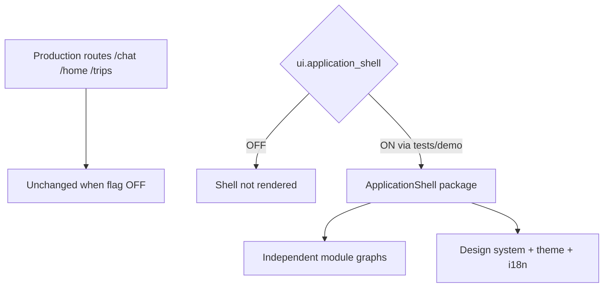
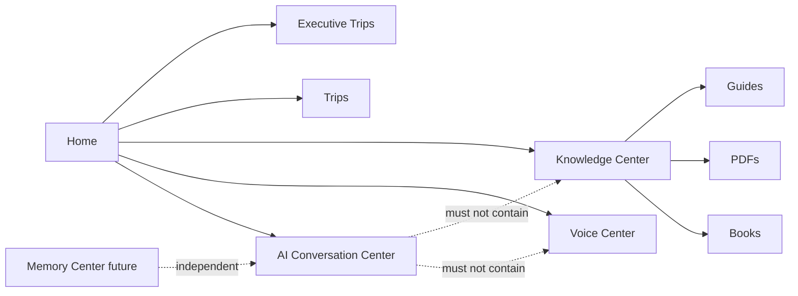

# Premium Application Shell — Phase 4 Stage 1

**Status:** Additive framework · Flag `ui.application_shell` **default OFF**  
**Freeze:** Production routes (`main.tsx`) · AI engines · planning · Runtime Coordinator · Conversation / Experience layers · booking / search / payment / maps.

This stage delivers the **application framework** every future screen will plug into. It does not implement booking or AI.

---

## 1. Why production remains unchanged

1. Flag default **OFF**  
2. Package is **not mounted** in `main.tsx` / production routers  
3. `ApplicationShell` returns `null` when the flag is OFF  
4. No changes to AI, planning, or prior Phase 3 packages  

---

## 2. Module architecture

| Module | Path prefix | Isolation |
|--------|-------------|-----------|
| Home | `/shell/home` | Entry |
| AI Conversation Center | `/shell/conversation` | Owns conversation history only |
| Voice Center | `/shell/voice` | Voice only — **not inside Chat** |
| Knowledge Center | `/shell/knowledge` | Books/PDFs/guides only — **not inside Chat** |
| Trips | `/shell/trips` | Traveler trips |
| Executive Trips | `/shell/executive-trips` | Executive surface |
| Notifications | `/shell/notifications` | Alerts |
| Profile | `/shell/profile` | Profile |
| Settings | `/shell/settings` | Theme / locale |
| Memory Center (future) | `/shell/memory` | Independent placeholder |

---

## 3. Navigation capabilities

- Bottom navigation  
- Side drawer  
- Deep linking  
- Nested routes  
- Independent navigation graphs per module  
- Navigation guards (auth + feature + visibility)  

---

## 4. Design system

Tokens: typography · spacing · radius · elevation  

Primitive catalog: cards · buttons · inputs · lists · sections · sheets · dialogs · badges · icons · loading · empty · error · skeletons · snackbars · bottom sheets  

---

## 5. Theme & localization & responsive

| Concern | Support |
|---------|---------|
| Theme | light / dark / system + dynamic CSS variables |
| Locale | Arabic RTL · English LTR · catalog keys for future locales |
| Breakpoints | phone · foldable · tablet · desktop |

---

## 6. Package layout

`src/ui/applicationShell/`

| Area | Role |
|------|------|
| `modules/` | Module registry + isolation rules |
| `navigation/` | Routes, graphs, deep links, guards |
| `designSystem/` | Tokens + primitive specs |
| `theme/` | Light/dark tokens |
| `localization/` | RTL/LTR state + labels |
| `state/` | Navigation / theme / auth / modules / flags |
| `layout/` | ApplicationShell · BottomNavigation · SideDrawer |

---

## 7. Feature flag

| Flag | Default |
|------|---------|
| `ui.application_shell` | **OFF** |
