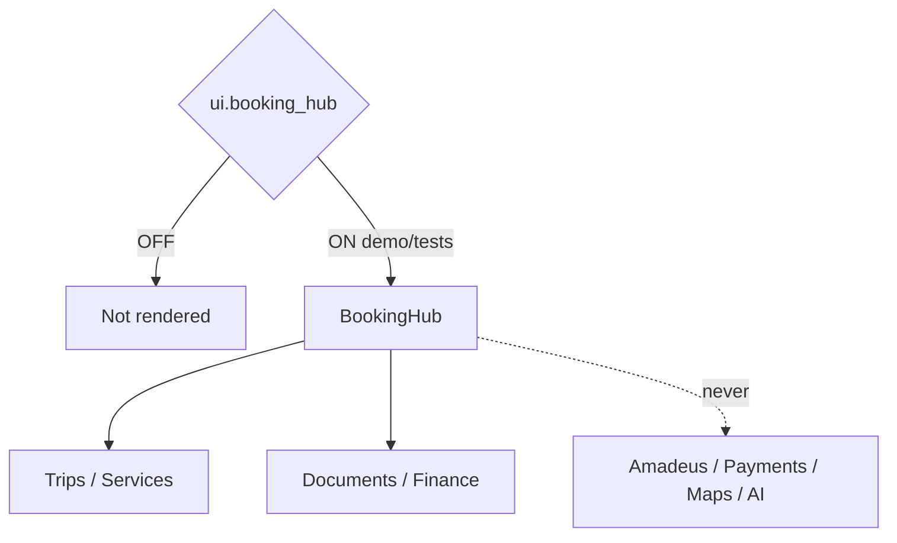

# Booking Hub — Phase 5 Stage 6

**Status:** Additive presentation · Flag `ui.booking_hub` **default OFF**  
**Depends on:** `ui.application_shell`  
**Freeze:** Production · AI · Booking APIs · Amadeus · Payments · Maps · Realtime · Notifications · Runtime · Database · Firebase · prior PRs.

Premium Booking Hub — **presentation and placeholders only**.

## Sections

Overview · Upcoming / Past Trips · Flights · Hotels · Transportation · Cruises · Trains · Activities · Restaurants · Events · Insurance · Visa Status · Documents · Tickets · Invoices · Refunds · Payment Summary · Traveler Assignment · Booking Timeline · Price Breakdown · Provider Cards · Calendar · Map Placeholder · Search · Filters · Favorites · Bookmarks

Force-render: `<BookingHub enabled />`.
