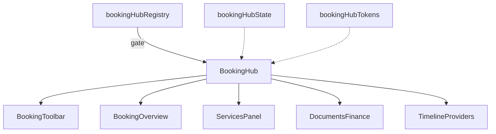

# Booking Hub — Architecture Notes

**Package:** `src/ui/bookingHub/`

| Concern | Status |
|---------|--------|
| Production routes | Not mounted |
| Booking APIs / Amadeus / Payments / Maps | Not wired |
| AI / Runtime / Database / Firebase | Not wired |
| Realtime / Notifications | Not wired |
| RTL + light/dark + reduced motion | Yes |
