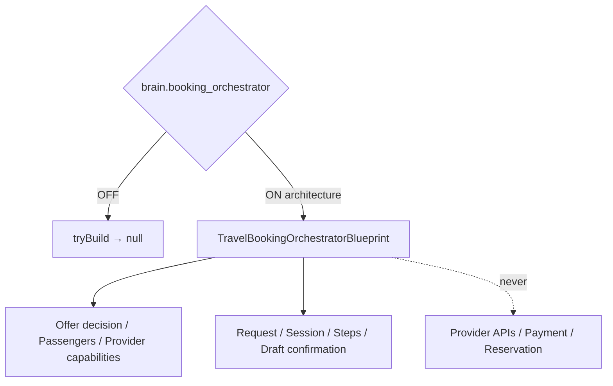

# Travel Booking Orchestrator — Phase 7 Stage 11

**Status:** Architecture only · Flag `brain.booking_orchestrator` **default OFF**  
**Depends on:** `brain.offer_decision_engine`  
**Package:** `src/lib/orchestration/travelBookingOrchestrator/`  
**Distinct from:** `booking.orchestrator` · `src/lib/booking` · `src/core/booking` · Booking Hub docs  
**Freeze:** Runtime · LLM · Provider APIs · Booking execution · Payments · Reservations · Emails · Notifications · HTTP · OCR · Auth · Database · Storage · prior PRs.

Prepares **booking workflows** from offer decisions — multi-provider abstraction, state transitions, lifecycle, validation, rollback/retry strategies, and auditability.

**NEVER executes bookings. NEVER contacts providers. NEVER performs payment. NEVER creates reservations. NEVER sends emails/notifications. Preparation architecture only.**

## Created (contracts)

Booking Orchestrator · Pipeline · Schema · Lifecycle · Strategy · Validation · Provider Abstraction · Rollback · Retry · Audit · Snapshot · Revision · Confidence

## Output contracts

`BookingRequest` · `BookingCandidate` · `BookingSession` · `BookingStep` · `BookingValidation` · `BookingConfirmationDraft` · `BookingFailure` · `BookingRevision` · `BookingSnapshot` · `BookingConfidence`

Force blueprint: `tryBuildTravelBookingOrchestratorBlueprint({ enabled: true })`.

See also: `AI_BOOKING_PIPELINE.md`, `AI_BOOKING_SCHEMA.md`, `AI_BOOKING_LIFECYCLE.md`, `AI_BOOKING_STRATEGY.md`, `AI_BOOKING_VALIDATION.md`, `AI_EVOLUTION_PHASE7_STAGE11.md`.
