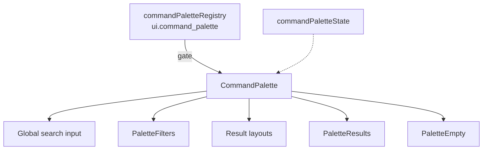

# Command Palette — Architecture Notes

| Concern | Status |
|---------|--------|
| Production routes | Not mounted |
| Backend / APIs / indexing | None |
| AI / realtime search | None |
| Chat / Voice / Knowledge embeds | None (command labels only) |
| Light/dark + RTL | Yes |
| Reduced motion | Respected |
