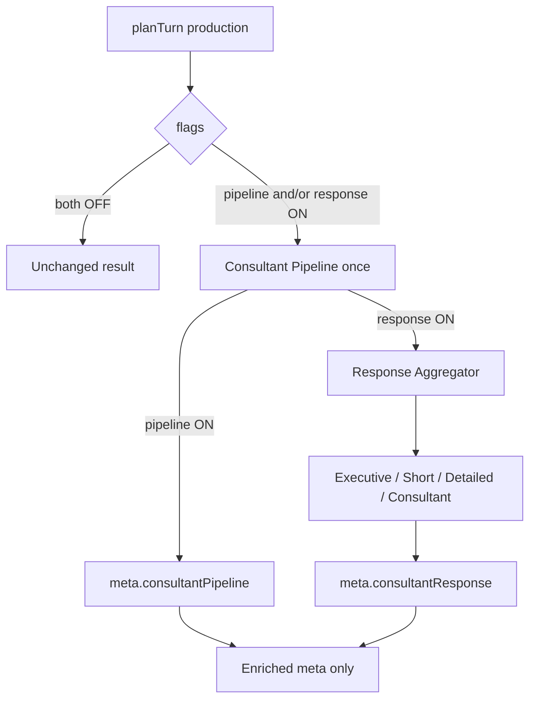

# AI Consultant Response — Aggregation Report (Stage 3)

**Branch:** `cursor/ai-integration-stage3-unified-response-7518`  
**Base:** Stage 2 pipeline-activation branch  
**Scope:** Unified Consultant Response aggregation layer  
**Merge:** Do **not** merge (draft PR only). Do **not** modify previous PRs.

---

## Verdict

Stage 3 adds a read-only **Unified Consultant Response** layer behind `ai.consultant_response` (default **OFF**). It aggregates Traveler, Destination, Strategy, Recommendation, Reflection, and Planning Graph outputs from the Consultant Pipeline into one multi-format package (`meta.consultantResponse`). Production planning remains unchanged while the flag is OFF and is never mutated while ON.

---

## Aggregation architecture

---

## Aggregation report

| Source stage | Fields contributed |
|--------------|-------------------|
| Traveler Intelligence | travelerUnderstanding, evidence |
| Destination Intelligence | destinationUnderstanding, benefits/risks priors |
| Travel Strategy | recommendedStrategy, tradeoffs, risks, opportunityCost |
| Recommendation Intelligence | primary/alternative, benefits, risks, questions |
| Reflection | latest recommendation cues |
| Planning Graph | evidence attribution |

Rules honored:

- Read-only stage bags  
- Low confidence → missing evidence + questions, no invented facts  
- Fail-open on aggregation errors  

---

## Performance report

| Mode | Cost |
|------|------|
| `ai.consultant_response` OFF | Sync registry check only |
| ON (alone or with pipeline) | One pipeline run + in-memory aggregation |
| Network / LLM | None |
| Planning mutation | None |

Telemetry (no PII): `responseGenerationMs`, `aggregationMs`, `confidence`, `questionCount`, success/failure.

---

## Files added / modified

### Added

| Path | Role |
|------|------|
| `src/lib/agent/orchestrator/consultantResponse*.ts` | Types, feature, aggregator, formats, telemetry, entry |
| `src/lib/__tests__/consultantResponse.stage3.test.ts` | Aggregation tests |
| `AI_UNIFIED_RESPONSE.md` | Architecture |
| `AI_CONSULTANT_RESPONSE.md` | This report |

### Modified

| Path | Change |
|------|--------|
| `travelAgentService.ts` | Stage 2/3 finalize wrapper + `consultantResponseEnabled` |
| `consultantActivation.ts` | `finalizeConsultantTurnEnrichment` (single pipeline run) |
| `types.ts` / feature registry / `FEATURE_REGISTRY.md` | Flag + meta shape |
| Orchestrator / agent barrels | Additive exports |

---

## Validation

- `npm run lint`
- `npm run typecheck`
- `npm run arch:circular`
- `npm run test:run`

---

## Explicit non-goals (honored)

- No intelligence / planning changes  
- No existing test edits  
- No merge / no rebase of prior PRs
