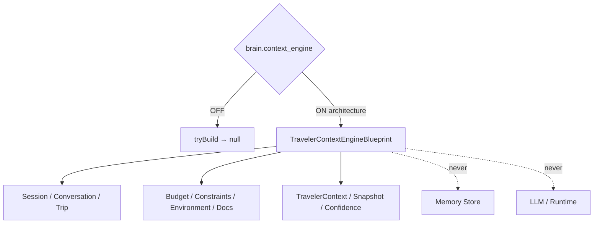

# Traveler Context Engine — Phase 7 Stage 5

**Status:** Architecture only · Flag `brain.context_engine` **default OFF**  
**Depends on:** `brain.preference_extraction`  
**Distinct from:** Memory Engine · `brain.context_memory`  
**Freeze:** LLM · Runtime · Database · Storage · HTTP · APIs · Business logic · prior PRs.

Understands the traveler's **current situation** before every response — live conversation context, not long-term Memory.  
**Blueprints only. No implementation.**

## Package

`src/lib/orchestration/travelerContextEngine/`

## Combines (declarative hints)

Current Trip · Current Session · Conversation State · Current Intent · Current Goals · Traveler Preferences · Constraints · Environment · Time · Location · Budget · Available Documents

## Created (contracts)

Context Engine · Conversation/Travel/Trip/Session · Traveler State · Environment/Constraint/Budget/Destination/Timeline/Companion/Weather/Transportation/Accommodation/Activity/Visa/Goal · Conversation Snapshot · Confidence · Freshness · Merge Rules · Priorities · Validation

## Output contracts

`TravelerContext` · `ConversationContext` · `TripContext` · `SessionContext` · `ContextSnapshot` · `ContextConfidence` · `ContextValidation`

Force blueprint: `tryBuildTravelerContextEngineBlueprint({ enabled: true })`.

See also: `AI_CONTEXT_PIPELINE.md`, `AI_TRAVEL_CONTEXT.md`, `AI_CONTEXT_SCHEMA.md`, `AI_CONTEXT_VALIDATION.md`, `AI_CONTEXT_LIFECYCLE.md`, `AI_EVOLUTION_PHASE7_STAGE5.md`.
