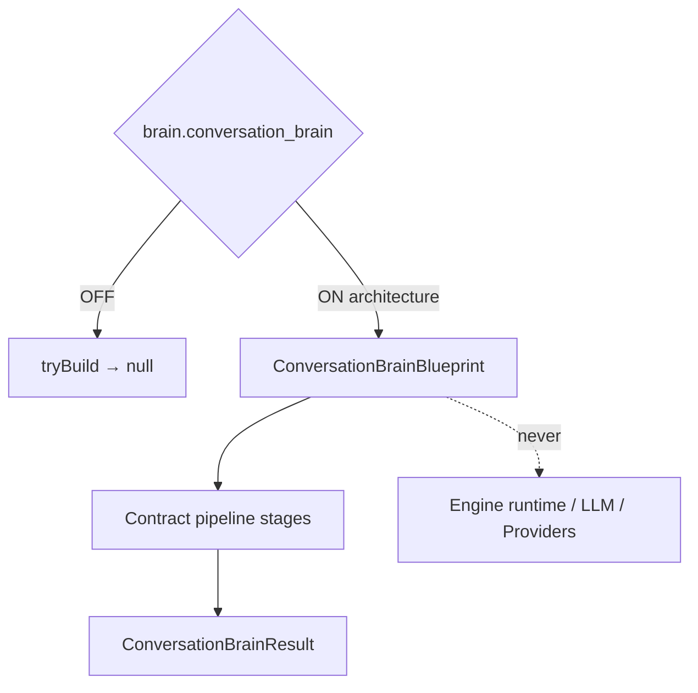

# AI Conversation Brain Orchestrator — Phase 7 Stage 12

**Status:** Architecture only · Flag `brain.conversation_brain` **default OFF**  
**Depends on:** `brain.booking_orchestrator`  
**Package:** `src/lib/orchestration/conversationBrain/`  
**Distinct from:** `src/lib/agent/conversationBrain` · `brain.conversation_orchestrator` · `ai.conversation_orchestrator`  
**Freeze:** Runtime · LLM · HTTP · Providers · Booking execution · Database · UI · business logic · prior PRs.

Coordinates previously designed Phase 7 engines **through contracts only** into a single conversation pipeline ending in `ConversationBrainResult`.

**NEVER invokes engines. NEVER calls providers. NEVER uses LLM runtime. NEVER executes booking. NEVER wires UI.**

## Created (contracts)

Engine · Pipeline · Schema · Strategy · Validation · Lifecycle · Snapshot · Revision

## Output contracts

`ConversationBrainRequest` · `ConversationBrainState` · `ConversationBrainStep` · `ConversationBrainDecision` · `ConversationBrainResult` · `ConversationBrainConfidence` · `ConversationBrainValidation` · `ConversationBrainSnapshot` · `ConversationBrainRevision`

Force blueprint: `tryBuildConversationBrainBlueprint({ enabled: true })`.

See also: `AI_CONVERSATION_PIPELINE.md`, `AI_CONVERSATION_FLOW.md`, `AI_CONVERSATION_SCHEMA.md`, `AI_CONVERSATION_VALIDATION.md`, `AI_EVOLUTION_PHASE7_STAGE12.md`.
