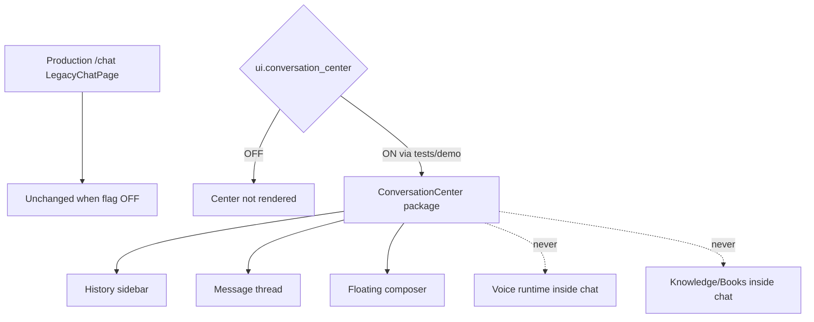
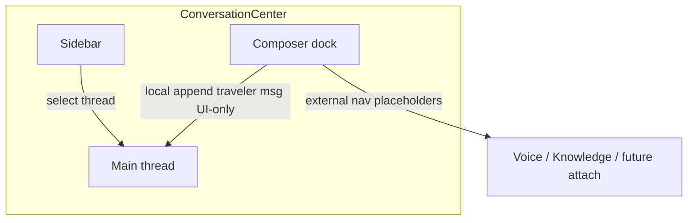

# Premium AI Conversation Center — Phase 4 Stage 2

**Status:** Additive UI architecture · Flag `ui.conversation_center` **default OFF**  
**Depends on:** `ui.application_shell` (registry dependency; both remain OFF in production)  
**Freeze:** Production routes · Runtime Coordinator · Conversation Orchestrator · Experience Layer · AI / networking / speech / knowledge loading · booking / payments / maps · prior PRs.

This stage delivers Rahhal’s **primary chat screen architecture**. It does not call AI or backends.

---

## 1. Why production remains unchanged

1. Flag default **OFF** (and depends on shell, also OFF)  
2. Package is **not mounted** in `main.tsx` / production routers  
3. `ConversationCenter` returns `null` when the flag is OFF  
4. No wiring into Runtime Coordinator or Conversation Orchestrator  
5. No AI calls, APIs, or networking inside this package  

---

## 2. Screen architecture

| Region | Role |
|--------|------|
| Sidebar | Recent / Pinned / Favorites / Archived / Drafts / Templates + search + thread actions |
| Main thread | Large conversation area, message kinds, travel cards, jump-to-latest |
| Composer dock | Floating auto-growing textarea, quick actions, external-nav placeholders |

---

## 3. Message types

Traveler · Assistant · System · Thinking · Loading · Error · Clarification · Recommendation · Warning · Success · Timeline · Executive Summary · Travel Plan · Destination / Hotel / Flight / Transportation / Visa / Weather / Budget / Checklist / Action cards · Expandable cards.

---

## 4. Chat & message features (UI)

**Threads:** search · pin · archive · rename · delete · export/share placeholders · favorite · unread markers · jump to latest  

**Messages:** copy · like · dislike · regenerate · expand/collapse · references placeholder · confidence badge · timestamp · streaming placeholder  

---

## 5. Composer rules

- Auto-growing textarea  
- Quick actions  
- Attachment / image / mic / camera / location **placeholders**  
- Voice + Knowledge buttons are **navigation placeholders only**  

**Must not exist inside Chat:** Voice runtime · Books · Knowledge loading / surfaces.

---

## 6. Empty states

First conversation · No history · No search results · Offline · Loading

---

## 7. Package map

`src/ui/conversationCenter/`

- `ConversationCenter.tsx` — root gate + layout  
- `ConversationSidebar.tsx` — history buckets  
- `MessageList.tsx` / `MessageBubble.tsx` — thread  
- `Composer.tsx` — floating input  
- `cards/TravelCards.tsx` — card placeholders  
- `EmptyStates.tsx`  
- `state/` · `design/` · `types.ts` · registry  

---

## 8. Feature flag

| Id | Default | Depends on |
|----|---------|------------|
| `ui.conversation_center` | OFF | `ui.application_shell` |

Force-render for demos/tests: `<ConversationCenter enabled />` or `tryRenderConversationCenter({ enabled: true })`.
