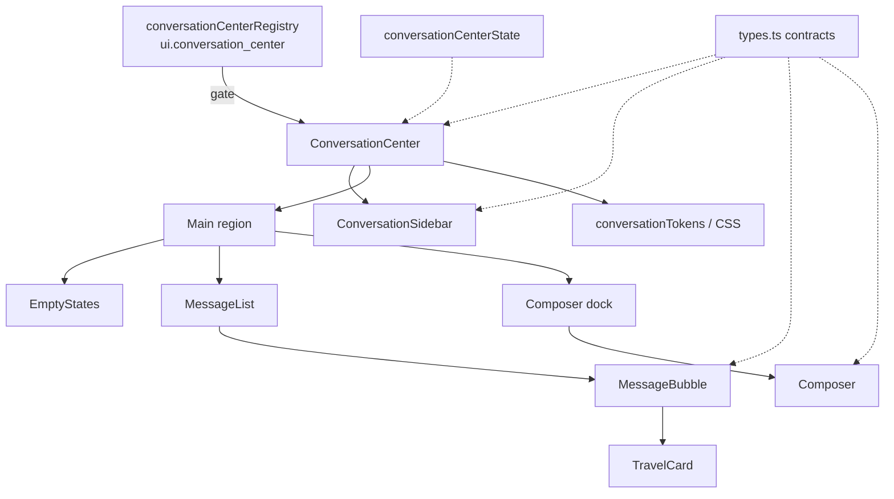
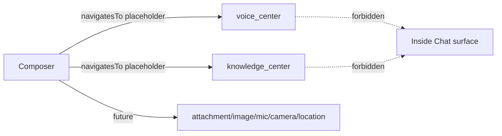

# Conversation Center — Component Diagram

**Phase 4 Stage 2** · Package `src/ui/conversationCenter`

## Component responsibilities

| Component | Responsibility |
|-----------|----------------|
| `ConversationCenter` | Feature gate, layout grid, local UI state, no AI |
| `ConversationSidebar` | Buckets, search, thread list, pin/archive/rename/delete, export/share placeholders |
| `MessageList` | Scroll region, jump-to-latest, appear animation hook |
| `MessageBubble` | Kind/role rendering, actions, confidence, streaming placeholder |
| `TravelCard` | Destination/hotel/flight/… expandable placeholders |
| `Composer` | Auto-grow textarea, quick actions, external-nav buttons |
| `EmptyStates` | First / no history / no results / offline / loading |

## External nav (not embeds)

