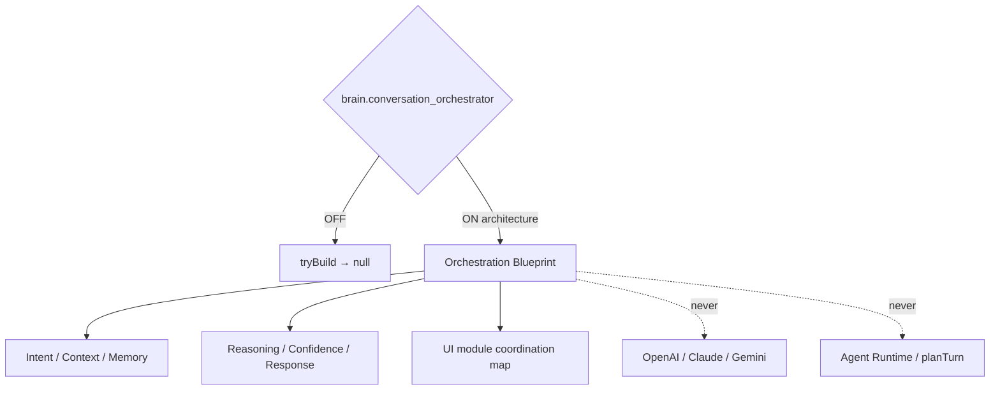

# AI Conversation Orchestrator — Phase 6 Stage 2

**Status:** Architecture only · Flag `brain.conversation_orchestrator` **default OFF**  
**Depends on:** `ui.integration_foundation`  
**Distinct from:** Phase 3 `ai.conversation_orchestrator` (agent execution layer — unchanged)

Internal brain architecture that **coordinates UI modules** via contracts.  
**No LLM calls. No APIs. No Runtime execution. No production wiring.**

## Package

`src/lib/orchestration/conversationOrchestrator/`

## Created (contracts)

Conversation Orchestrator · Intent Pipeline · Context Builder · Memory Reader/Writer · Planning / Decision / Traveler / Booking / Workspace Context · Conversation Session · Timeline · State Machine · Response Pipeline · Clarification Engine · Question Generator · Confidence Engine · Reasoning Pipeline · Task Queue · Planning Queue · Conversation Events · Conversation Registry · Conversation Analytics

## Isolation

| Concern | Status |
|---------|--------|
| OpenAI / Claude / Gemini / Azure / Vertex | Not wired |
| Firebase / Supabase / Database / Realtime / Auth | Not wired |
| Payments / Maps / Weather / Booking / Amadeus | Not wired |
| LLM execution / API implementation / Runtime | None |

Force blueprint: `tryBuildConversationOrchestrationBlueprint({ enabled: true })`.
