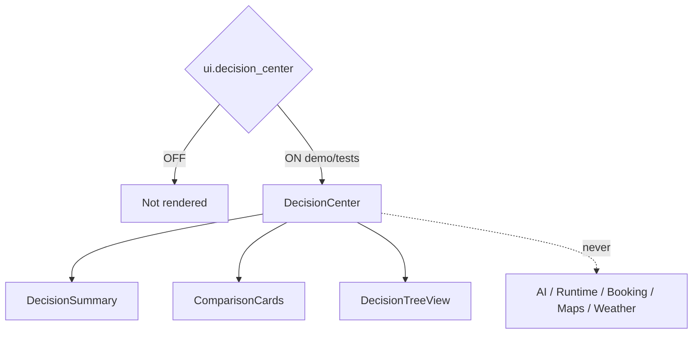

# AI Decision Center — Phase 5 Stage 2

**Status:** Additive presentation · Flag `ui.decision_center` **default OFF**  
**Depends on:** `ui.application_shell`  
**Freeze:** Production · AI reasoning · Runtime · Booking · Maps · Weather · Notifications · prior PRs.

Premium Decision Center UI — **placeholders and presentation only**.

## Sections

Decision Summary · Why this recommendation · Alternatives · Pros · Cons · Confidence Score · Cost/Time/Comfort Comparison · Risk Indicators · Travel Score · Recommendation Reason

## Decision types

Flight · Hotel · Transportation · Activity · Restaurant · Meeting Time · Budget · Travel Route

## Visuals

Comparison cards · Decision tree · Score bars · Confidence meter · Timeline impact · Cost charts placeholder · Risk labels · Recommendation cards

## States

Recommended · Alternative · Best Value · Fastest · Luxury · Budget · Eco

Force-render: `<DecisionCenter enabled />`.
