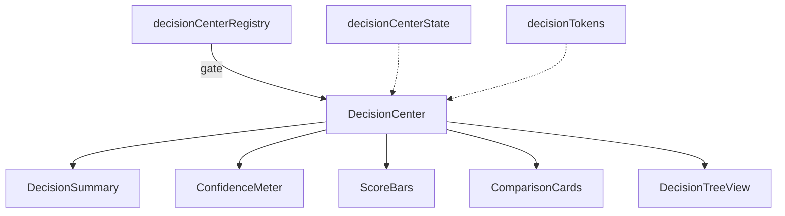

# Decision Center — Architecture Notes

**Package:** `src/ui/decisionCenter/`

| Concern | Status |
|---------|--------|
| Production routes | Not mounted |
| Actual AI reasoning | None (copy placeholders) |
| Runtime / Booking / Maps / Weather / Notifications | Not wired |
| Backend / realtime | None |
| RTL + light/dark + reduced motion | Yes |
