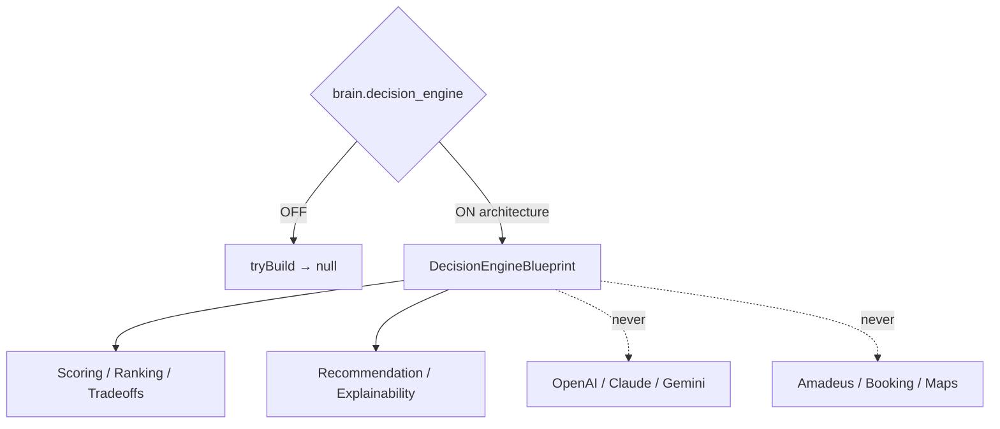

# AI Decision Engine — Phase 6 Stage 4

**Status:** Architecture only · Flag `brain.decision_engine` **default OFF**  
**Depends on:** `brain.planning_engine`  
**Freeze:** LLMs · Runtime · Booking APIs · Amadeus · Maps · Weather · Payments · Firebase · Supabase · Realtime · Auth · Business logic · prior PRs.

Evaluates planning alternatives and produces **structured recommendation contracts**.  
**No decision execution. No LLM implementation. No runtime logic.**

## Package

`src/lib/orchestration/decisionEngine/`

## Created (contracts)

Decision Engine · Pipeline · Context · Session · Registry · Events · State Machine · Alternative Evaluator · Ranking Engine · Scoring Engine · Confidence Calculator · Constraint Validator · Preference Matcher · Tradeoff Analyzer · Cost Optimizer · Risk Evaluator · Explainability Layer · Recommendation Builder · Analytics · Audit Trail

Force blueprint: `tryBuildDecisionEngineBlueprint({ enabled: true })`.
