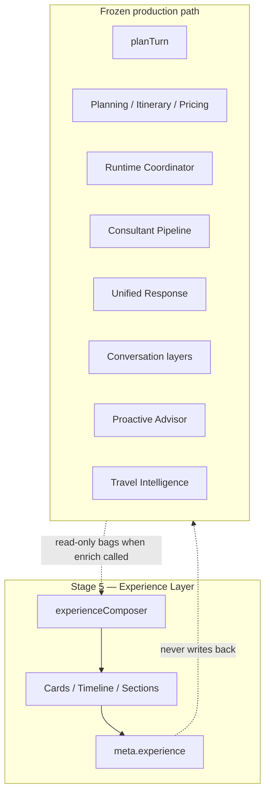

# AI Evolution — Phase 3 Stage 5

**Experience Intelligence Layer**

| Item | Value |
|------|--------|
| Flag | `ai.experience_layer` |
| Default | **OFF** |
| Base | Phase 3 Stage 4 Travel Intelligence (registry dependency only) |
| Scope | Isolated UI presentation models · **not wired into planTurn** |

---

## Goal

Prepare rich, UI-ready experience models from existing AI outputs without changing planning or AI reasoning.

---

## Architecture



### Why production is identical when OFF

- `planTurn()` is not modified in this stage  
- No service option forces experience enrichment on the production path  
- Registry default is OFF; dependents cannot activate it accidentally without enabling the whole chain  

---

## Deliverables

- `src/lib/agent/experience/*`
- Feature registry entry `ai.experience_layer` (experimental, OFF)
- `AgentProviderMeta.experience` type
- Docs: `AI_EXPERIENCE_LAYER.md`, this file
- New tests: `src/lib/__tests__/experienceLayer.phase3.stage5.test.ts`

---

## Validation

```
npm run lint
npm run typecheck
npm run arch:circular
npm run test:run
```

---

## Non-goals

- External APIs (weather, maps, hotels, flights, visas)  
- Speech / TTS / Knowledge retrieval implementations  
- Modifying or merging previous PRs  
- Refactoring Stages 1–4  

## Validation (Phase 3 Stage 5)

| Check | Result |
|-------|--------|
| `npm run lint` | pass |
| `npm run typecheck` | pass |
| `npm run arch:circular` | pass |
| `npm run test:run` | **2789** passed |

