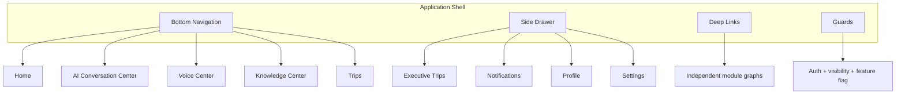
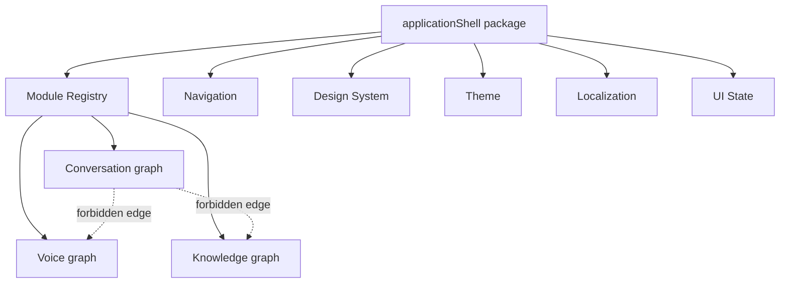

# AI Evolution — Phase 4 Stage 1

**Premium Application Shell & Navigation Foundation**

| Item | Value |
|------|--------|
| Flag | `ui.application_shell` |
| Default | **OFF** |
| Scope | Application framework only |
| Production routes | **Not wired** |

---

## Goal

Create the professional shell structure that future Rahhal screens will plug into — without booking, AI, or planning changes.

---

## Architecture diagrams

### Navigation



### Module dependencies (isolation)



---

## Deliverables

- `src/ui/applicationShell/*`
- Feature registry: `ui.application_shell`
- Docs: `AI_APPLICATION_SHELL.md`, `AI_DESIGN_SYSTEM_SHELL.md`, this file
- Tests: `src/lib/__tests__/applicationShell.phase4.stage1.test.ts`

---

## Validation

```
npm run lint
npm run typecheck
npm run arch:circular
npm run test:run
```

---

## Non-goals

- Booking / search / payment / maps  
- AI / Runtime / Conversation / Experience modifications  
- Mounting shell routes in production `main.tsx`  
- Merging or modifying previous PRs  

## Validation (Phase 4 Stage 1)

| Check | Result |
|-------|--------|
| `npm run lint` | pass |
| `npm run typecheck` | pass |
| `npm run arch:circular` | pass |
| `npm run test:run` | **2799** passed |

