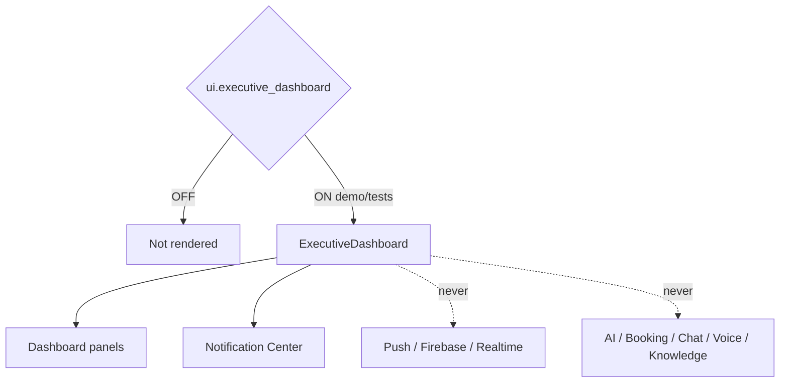

# Executive Dashboard — Phase 4 Stage 6

**Status:** Additive UI · Flag `ui.executive_dashboard` **default OFF**  
**Depends on:** `ui.application_shell`  
**Freeze:** Production · AI · Runtime Coordinator · Chat · Voice · Knowledge · Booking · push / realtime / Firebase / APIs · prior PRs.

Presentation layer for executive travel command — **no backend**.

## Regions

- Metrics (trips, flights, travelers, hotels, documents, tasks)  
- Filters (today / tomorrow / week / trips / meetings / flights / hotels / transport / documents)  
- Dashboard panels (upcoming trips, schedule, board meetings, flight timeline, hotel/transport status, travelers, pending actions, activity, progress, executive summary)  
- Widgets (weather/currency placeholders, world clock, countdown, progress ring, status indicators)  
- Calendar placeholder (monthly / weekly / daily / agenda)  
- Action cards (view trip/traveler, open timeline/documents, calendar placeholder)  
- Global search  

## Isolation

Force-render: `<ExecutiveDashboard enabled />`.
