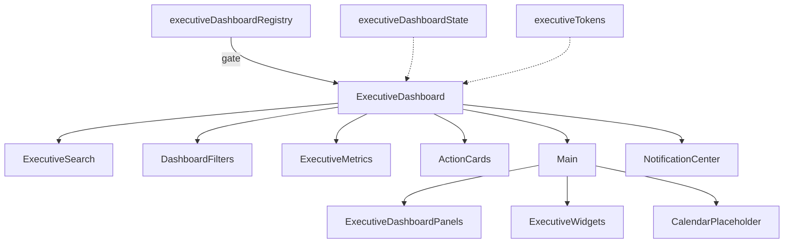

# Executive Dashboard — Component Diagram

## Architecture notes

- Package: `src/ui/executiveDashboard/`  
- Feature: `ui.executive_dashboard` (OFF)  
- Light/dark + RTL via `data-theme` / `dir`  
- Motion respects `prefers-reduced-motion`  
- Action cards and calendar are placeholders — no production navigation wiring  
