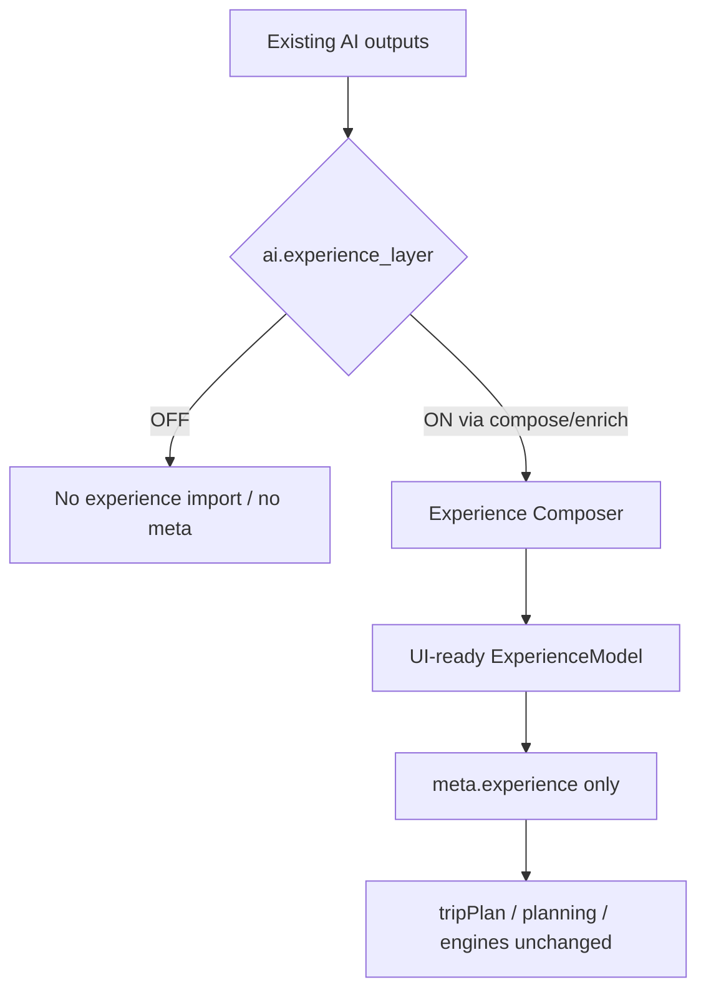
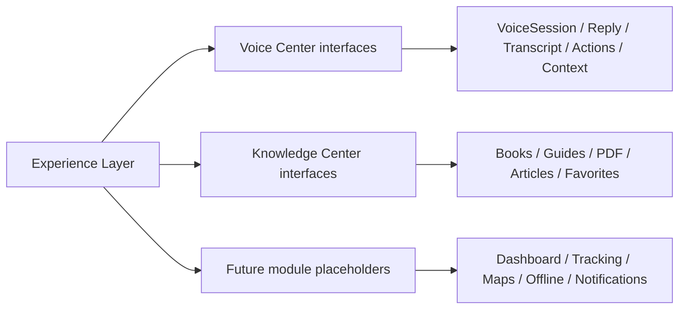

# AI Experience Intelligence Layer — Phase 3 Stage 5

**Status:** Additive isolated presentation layer · Flag `ai.experience_layer` **default OFF**  
**Freeze:** `planTurn` · planning engine · Runtime Coordinator · Consultant Pipeline · Unified Response · Conversation Orchestrator · Multi-Turn Manager · Proactive Advisor · Travel Intelligence · production flow.

The Experience Layer converts **existing** AI outputs into **UI-ready presentation models** for future mobile/web interfaces. It does **not** plan trips and does **not** call external APIs.

---

## 1. Why production remains unchanged

1. Flag default **OFF**  
2. Layer is **not wired into `planTurn()`**  
3. Enrichment is opt-in via `enrichTurnWithExperienceLayer` / `composeExperience`  
4. When used, it attaches **`meta.experience` only** — identity for `reply`, `tripPlan`, and other meta  

---

## 2. Responsibilities

| Builds | Notes |
|--------|-------|
| Executive Summary | From consultant / intelligence text |
| Trip / Destination Highlights | Known facts only |
| Timeline | Lightweight day markers (not itinerary edits) |
| Recommended Actions | Presentation CTAs |
| Important Alerts | From proactive titles when present |
| Placeholders | Weather, visa, transport, hotel, flight, budget |
| Alternatives | From travel intelligence ranks when present |
| Quick Facts / Confidence / Missing / Next Questions | Read-only |

---

## 3. Package

`src/lib/agent/experience/`

| Module | Role |
|--------|------|
| `experienceComposer.ts` | Compose + enrich (meta-only) |
| `experienceCards.ts` | Card factory |
| `timelineBuilder.ts` | Timeline items |
| `tripHighlights.ts` | Trip highlight cards |
| `destinationHighlights.ts` | Destination cards |
| `recommendationCards.ts` | Actions / alerts / alternatives / placeholders |
| `tripSections.ts` | Section grouping |
| `tripSummary.ts` | Summary + source fact extraction |
| `experienceRegistry.ts` | Flag + future module catalog |
| `types.ts` | Models + Voice/Knowledge interfaces |
| `index.ts` | Barrel |

---

## 4. Extension points

| Center | Status |
|--------|--------|
| **Voice** | Interfaces only (`ExperienceVoiceSession`, `ExperienceVoiceReply`, `ExperienceVoiceTranscript`, `ExperienceVoiceAction`, `ExperienceVoiceContext`) — no speech/TTS |
| **Knowledge** | Empty surface + typed catalogs — no retrieval |
| **Future modules** | Placeholder ids for dashboard, live tracking, maps, offline, etc. |

---

## 5. Feature flag

| Flag | Default | Depends on |
|------|---------|------------|
| `ai.experience_layer` | **OFF** | `ai.travel_intelligence` |

---

## 6. Safety

- No weather / maps / hotel / flight / visa APIs  
- No planning mutations  
- Append-only architecture (presentation compose only)  
- No circular imports into prior engines  
