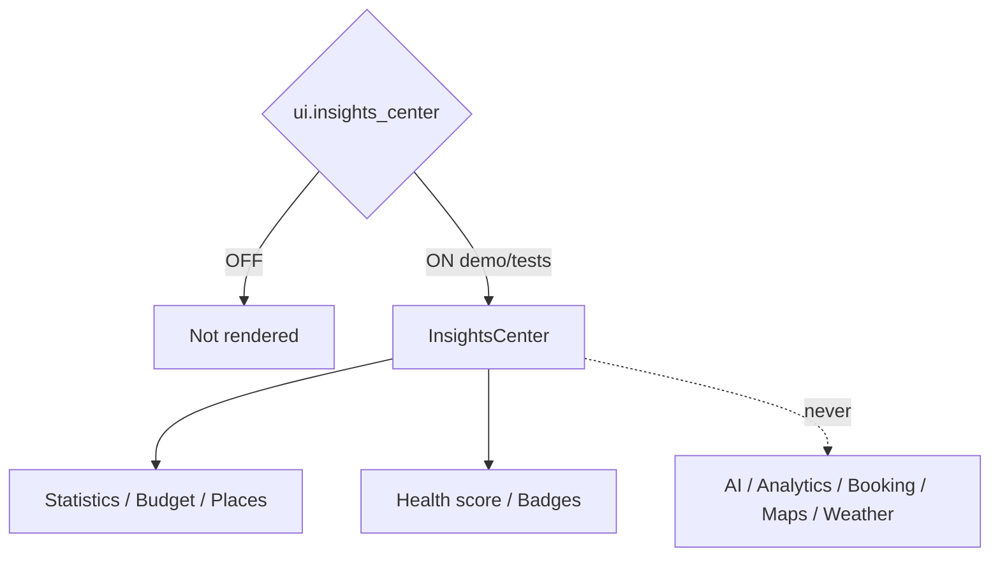

# AI Insights Center — Phase 5 Stage 3

**Status:** Additive presentation · Flag `ui.insights_center` **default OFF**  
**Depends on:** `ui.application_shell`  
**Freeze:** Production · AI · Runtime · Booking · Maps · Weather · Notifications · analytics engines · prior PRs.

Premium Insights Center — **presentation and placeholders only**.

## Sections

Travel Overview · Travel Statistics · Budget Overview · Savings · Cost Breakdown · Visited Countries/Cities · Favorite Airlines/Hotels · Trip Frequency · Upcoming/Completed/Cancelled Trips · Passport/Visa/Loyalty/Carbon placeholders · Travel Health Score · Journey Activity · Travel Timeline Summary

## Visuals

Charts placeholder · Progress rings · Trend cards · Statistics cards · Heat maps placeholder · Timeline charts · Comparison widgets · Score cards · Achievement badges

## Filters

This Trip · This Month · This Year · Lifetime · Business · Personal

Force-render: `<InsightsCenter enabled />`.
