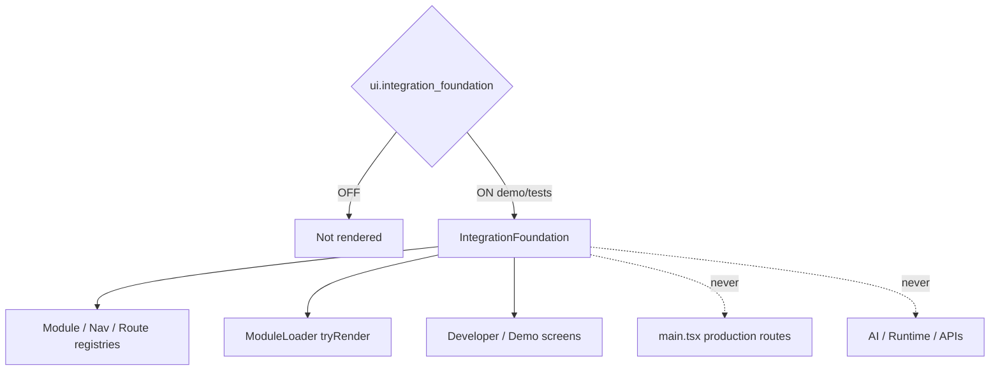

# Integration Foundation — Phase 6 Stage 1

**Status:** Additive presentation architecture · Flag `ui.integration_foundation` **default OFF**  
**Depends on:** `ui.application_shell`  
**Freeze:** Production · AI · Runtime · Realtime · Auth · Firebase · Database · APIs · Booking · Payments · Maps · Notifications · Search backend · Business logic · prior PRs.

Unifies existing UI modules via registries, loaders, and shared chrome. **No service/API/business layers.**

## Integrated modules

Application Shell · Conversation Center · Voice Center · Travel Workspace · Executive Dashboard · Command Palette · Journey Timeline · Decision Center · Insights Center · Traveler Profile · Memory Center · Booking Hub · Operations Center

## Built

Module Registry · Navigation Registry · Shared Route Registry · Shared Layout Manager · Module Loader · Feature Flag Manager · Shared Empty/Loading/Error States · Shared Page Transitions · Shared Motion / Icon / Theme / Typography / Spacing Tokens

## Development screens

Developer Navigation · Demo Navigation · Module Preview Pages · Feature Flag Toggle · Module Status · Dependency Graph · Architecture Overview

Force-render: `<IntegrationFoundation enabled />`.
