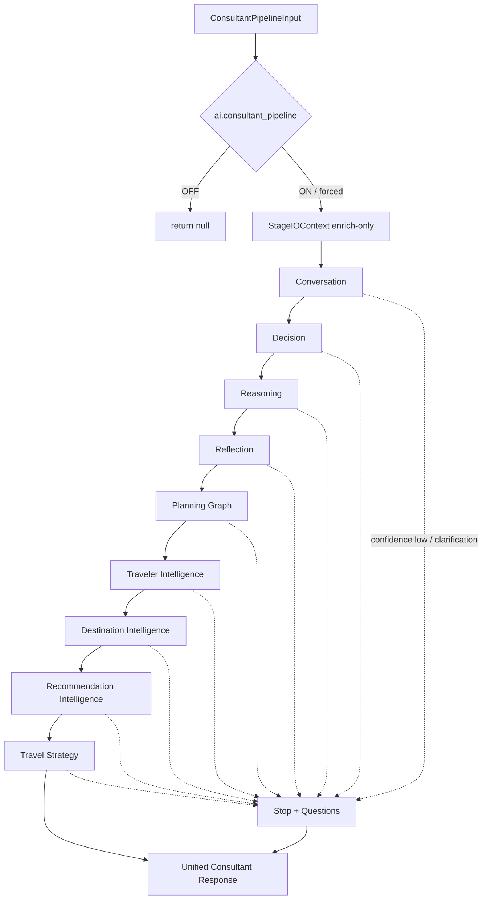

# AI Integration Report — Stage 1

**Branch:** `cursor/ai-integration-stage1-consultant-pipeline-7518`  
**Base:** Sprint 8 travel-strategy branch  
**Scope:** Orchestration layer only — integrate existing intelligence safely  
**Merge:** Do **not** merge (draft PR only). Do **not** rebase other PRs.

---

## Verdict

Stage 1 delivered an offline **Consultant Pipeline** under `src/lib/agent/orchestrator/` that sequences Conversation → Decision → Reasoning → Reflection → Planning Graph → Traveler → Destination → Recommendation → Travel Strategy → Unified Response. Flag **`ai.consultant_pipeline` OFF** · not wired to `planTurn` · enrich-only context · zero production behavior change while disabled. No frozen AI cores or evolution module internals were modified.

---

## Architecture diagram

---

## Pipeline flow

See `AI_INTEGRATION_STAGE1.md` §2 for the stage-by-stage flow and IO contract.

**Integration registry** (`integrationRegistry.ts`) maps each stage to an existing public entrypoint — Conversation Brain local path, Decision Engine, consultant reasoning/reflection, planning graph, traveler/destination/recommendation/strategy engines.

---

## Integration report

| Layer | Invoked via | Internal behavior changed? |
|-------|-------------|----------------------------|
| Conversation Brain | `generateLocalConversation` (CPU) | No |
| Decision Engine | `applyIntelligentDecisions` / `detectTripConflicts` when payloads exist | No |
| Planning Draft | `buildPlanningDraft` (optional enrich under decision) | No |
| Reasoning | `runConsultantReasoningPipeline` | No |
| Reflection | `reflectTurn` | No |
| Planning Graph | `createPlanningGraph` + `PlanningGraph.addRoot` | No |
| Traveler Intelligence | `observeTraveler` | No |
| Destination Intelligence | `runDestinationIntelligence` | No |
| Recommendation Intelligence | `runRecommendationEngine` | No |
| Travel Strategy | `runTravelStrategyEngine` | No |
| planTurn / Production Authority | — | **Untouched** |

**Safety properties demonstrated in tests:**

- Stage output bags are append-once (no overwrite).  
- Snapshot enrichment never clobbers already-set scalars.  
- Insufficient confidence / missing destination → stop + questions (no guessing).  
- Flag default OFF; `tryRun` is a no-op when disabled.

---

## Performance report

| Metric | Result |
|--------|--------|
| Network / LLM / API | None |
| Production chat while flag OFF | Unchanged / zero pipeline cost |
| Disabled `tryRun` | Immediate `null` |
| Enabled run | Dynamic import per stage; in-memory only |
| Lazy | Stage modules loaded only when a stage executes |

---

## Future activation plan

1. Validate Stage 1 orchestration in isolation (this PR).  
2. Preview-only UI / Brain meta mapping behind the same flag (later stage).  
3. Confidence UX + clarification copy review before any production attach.  
4. Explicit wiring sprint required before touching `planTurn`.  
5. Keep child evolution flags independently gated.

---

## Files added

| Path | Role |
|------|------|
| `src/lib/agent/orchestrator/pipelineTypes.ts` | Contracts |
| `src/lib/agent/orchestrator/integrationRegistry.ts` | Stage → module map + feature id |
| `src/lib/agent/orchestrator/consultantStages.ts` | Order + enable helper |
| `src/lib/agent/orchestrator/consultantContext.ts` | Enrich-only context |
| `src/lib/agent/orchestrator/consultantState.ts` | Run state |
| `src/lib/agent/orchestrator/consultantExecution.ts` | Lazy stage adapters |
| `src/lib/agent/orchestrator/consultantOutputs.ts` | Unified response |
| `src/lib/agent/orchestrator/consultantPipeline.ts` | Entry `run` / `tryRun` |
| `src/lib/__tests__/consultantPipeline.stage1.test.ts` | Orchestration tests |
| `AI_INTEGRATION_STAGE1.md` | Architecture / flow |
| `AI_INTEGRATION_REPORT.md` | This report |

## Files modified

| Path | Change |
|------|--------|
| `src/lib/ai/featureFlags/types.ts` | `FeatureId` += `ai.consultant_pipeline` |
| `src/lib/ai/featureFlags/featureRegistry.ts` | Register flag default OFF |
| `FEATURE_REGISTRY.md` | Document flag |
| `src/lib/agent/orchestrator/index.ts` | Additive Stage 1 exports |
| `src/lib/agent/index.ts` | Additive re-exports |

---

## Validation

- `npm run lint` — pass
- `npm run typecheck` — pass
- `npm run arch:circular` — pass (no cycles)
- `npm run test:run` — **2700** passed (231 files), including 9 new orchestration tests

---

## Explicit non-goals (honored)

- No production wiring / behavior changes  
- No intelligence rewrites / scoring changes  
- No existing test modifications  
- No merge to `main`  
- No rebase of other PRs
