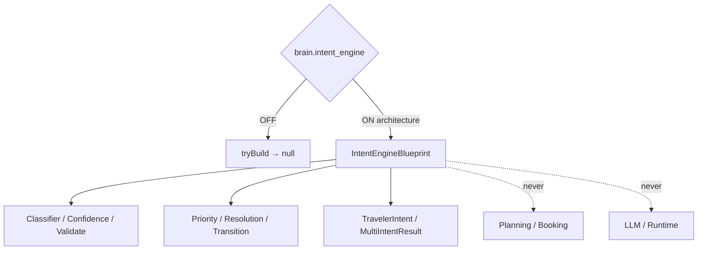

# Intent Recognition Engine — Phase 7 Stage 6

**Status:** Architecture only · Flag `brain.intent_engine` **default OFF**  
**Depends on:** `brain.context_engine`  
**Distinct from:** Sprint 19 `brain.intent`  
**Freeze:** LLM · Runtime · Database · Storage · HTTP · APIs · Business logic · prior PRs.

Identifies what the traveler wants **before** planning or booking begins.  
**Blueprints only. No implementation.**

## Package

`src/lib/orchestration/intentEngine/`

## Intent catalog (examples)

Book Flight · Book Hotel · Plan Trip · Modify Trip · Cancel Trip · Compare Destinations · Ask Question · Visa Inquiry · Budget Advice · Transportation · Restaurant Recommendation · Activity Search · Emergency Support · Customer Service · General Conversation · Multi-intent · Intent Switching

## Created (contracts)

Intent Engine · Registry · Classifier · Schema · Confidence · Validation · Priority Rules · Resolution Rules · Transition Model · Conversation/Travel/Booking/Support Intent · MultiIntent · History · Snapshot

## Output contracts

`TravelerIntent` · `IntentPrediction` · `IntentConfidence` · `IntentTransition` · `IntentValidation` · `MultiIntentResult`

Force blueprint: `tryBuildIntentEngineBlueprint({ enabled: true })`.

See also: `AI_INTENT_CLASSIFIER.md`, `AI_INTENT_PIPELINE.md`, `AI_INTENT_SCHEMA.md`, `AI_INTENT_TRANSITIONS.md`, `AI_INTENT_VALIDATION.md`, `AI_EVOLUTION_PHASE7_STAGE6.md`.
