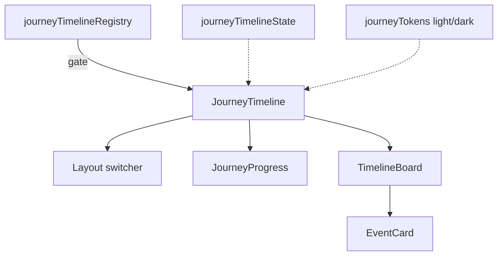

# Journey Timeline — Architecture Notes

**Package:** `src/ui/journeyTimeline/`

| Concern | Status |
|---------|--------|
| Production routes | Not mounted |
| AI / Runtime Coordinator | Not wired |
| Booking / Maps / Weather APIs | Not wired (placeholders only) |
| Realtime / notifications / backend | None |
| RTL + light/dark + reduced motion | Yes |
