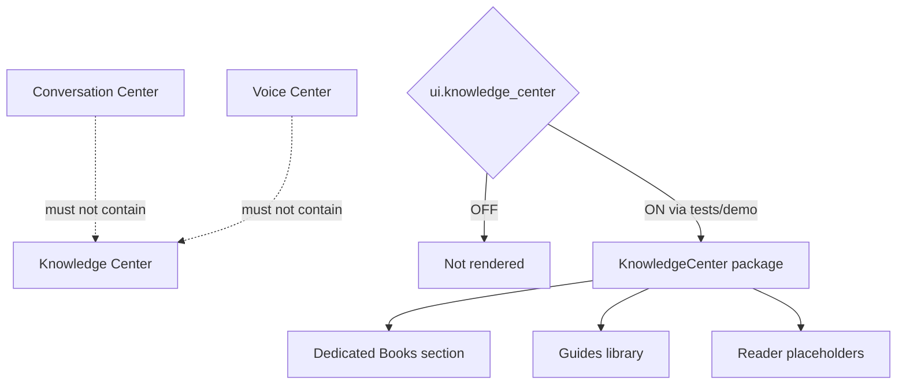

# Knowledge Center — Phase 4 Stage 4

**Status:** Additive UI architecture · Flag `ui.knowledge_center` **default OFF**  
**Depends on:** `ui.application_shell`  
**Freeze:** Production routes · Chat · Voice · Runtime Coordinator · Conversation Orchestrator · RAG / embeddings / vector DB / search APIs / OCR / cloud storage / AI · prior PRs.

Knowledge is a **dedicated destination**. It is **not** inside Chat or Voice.  
**Books** have their own dedicated section here only.

---

## 1. Why production remains unchanged

1. Flag default **OFF**  
2. Package **not mounted** in `main.tsx`  
3. `KnowledgeCenter` returns `null` when the flag is OFF  
4. No knowledge loading, RAG, embeddings, or search APIs  
5. No wiring to Voice Center / Orchestrator / Runtime Coordinator  

---

## 2. Main sections

Travel Guides · Country Guides · Visa Library · Airline Information · Airport Guides · Hotel Guides · Transportation · Emergency Contacts · Embassies · Travel Tips · FAQ · Company Policies · Executive Travel Manuals · **Books**

---

## 3. Document types

PDF · Books · Markdown · Images · Travel Documents · Maps · Videos placeholder · Audio placeholder

---

## 4. Search & organization (UI)

Global search · filters (type/country/language/tags) · bookmarks · recent · favorites  
Collections · folders · countries · topics · executive · personal · travel planning · visas · hotels · flights

---

## 5. Reader (placeholders)

PDF viewer · Book reader · Image viewer · Zoom · Fullscreen · Reading progress · Bookmarks · Notes · Highlights

---

## 6. Package map

`src/ui/knowledgeCenter/` — sidebar, smart panels, organization bar, document library, books section, reader, state, tokens, registry.

---

## 7. Feature flag

| Id | Default | Depends on |
|----|---------|------------|
| `ui.knowledge_center` | OFF | `ui.application_shell` |

Force-render: `<KnowledgeCenter enabled />` or `tryRenderKnowledgeCenter({ enabled: true })`.
