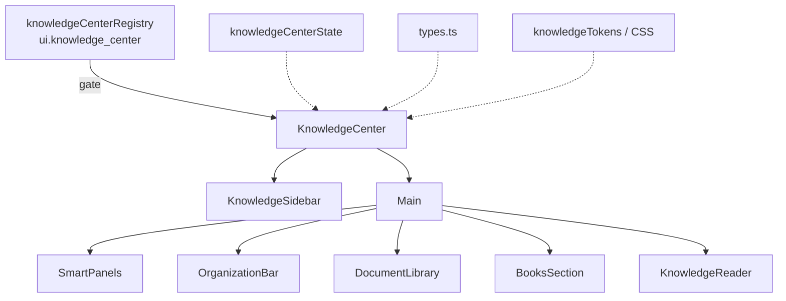

# Knowledge Center — Component Diagram

**Phase 4 Stage 4** · Package `src/ui/knowledgeCenter`

## Reader components

| Component | Modes / tools |
|-----------|----------------|
| `KnowledgeReader` | `pdf` · `book` · `image` · `none` |
| PDF placeholder | `kc-pdf-viewer-placeholder` |
| Book placeholder | `kc-book-reader-placeholder` |
| Image viewer | `kc-image-viewer` |
| Tools | Zoom · Fullscreen · Progress · Bookmark · Notes/Highlights placeholders |

## Responsibilities

| Component | Responsibility |
|-----------|----------------|
| `KnowledgeSidebar` | Brand, sidebar nav, global search, main sections (incl. Books) |
| `DocumentLibrary` | Filters + document grid + open/preview/favorite/bookmark + share/download/print placeholders |
| `BooksSection` | Dedicated shelf with two reserved slots for future books |
| `SmartPanels` | Recently opened / recommended / popular / favorites / downloads / offline |
| `OrganizationBar` | Collections / folders / countries / topics / … |
| `KnowledgeReader` | Reader chrome only — no OCR/PDF engine |
