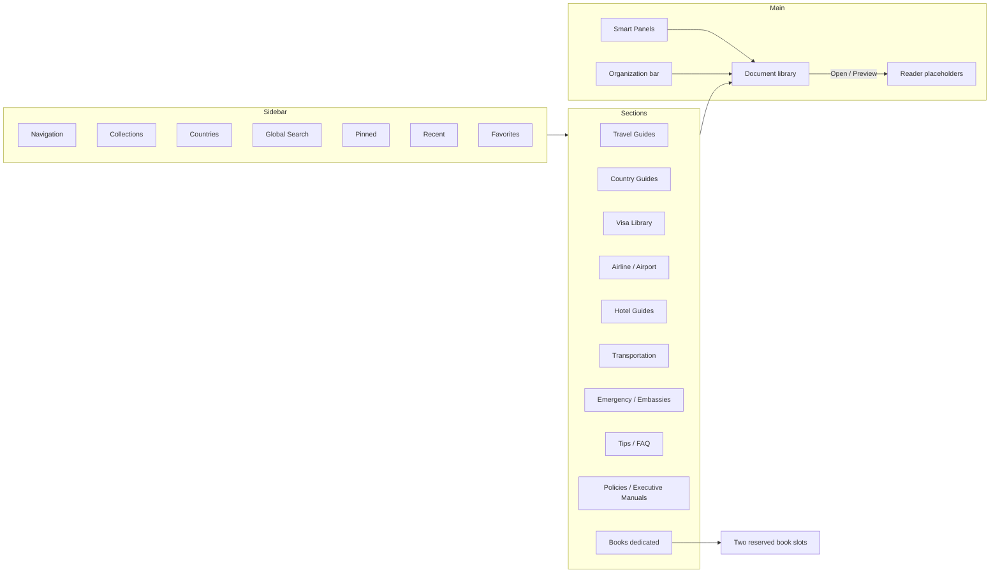
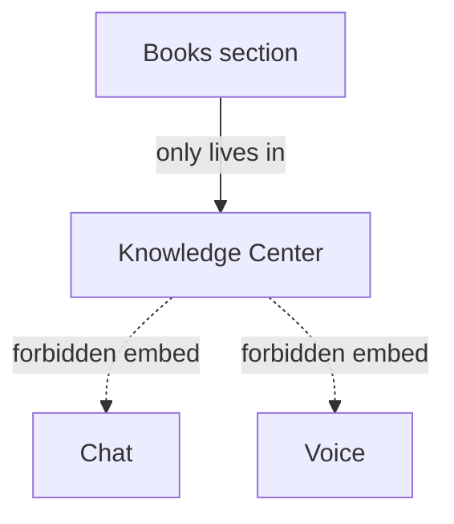

# Knowledge Center — Navigation Diagram

**Phase 4 Stage 4**

```mermaid
flowchart LR
  subgraph Sidebar
    Nav[Navigation]
    Col[Collections]
    Countries[Countries]
    Search[Global Search]
    Pin[Pinned]
    Recent[Recent]
    Fav[Favorites]
  end

  subgraph Sections
    TG[Travel Guides]
    CG[Country Guides]
    Visa[Visa Library]
    Air[Airline / Airport]
    Hotel[Hotel Guides]
    Transport[Transportation]
    Emer[Emergency / Embassies]
    Tips[Tips / FAQ]
    Policy[Policies / Executive Manuals]
    Books[Books dedicated]
  end

  subgraph Main
    Smart[Smart Panels]
    Org[Organization bar]
    Library[Document library]
    Reader[Reader placeholders]
  end

  Sidebar --> Sections
  Sections --> Library
  Books --> Shelf[Two reserved book slots]
  Library -->|Open / Preview| Reader
  Smart --> Library
  Org --> Library
```

## Isolation edges

```mermaid
flowchart TB
  KC[Knowledge Center]
  Chat[Chat]
  Voice[Voice]
  KC -.->|forbidden embed| Chat
  KC -.->|forbidden embed| Voice
  Books[Books section] -->|only lives in| KC
```
