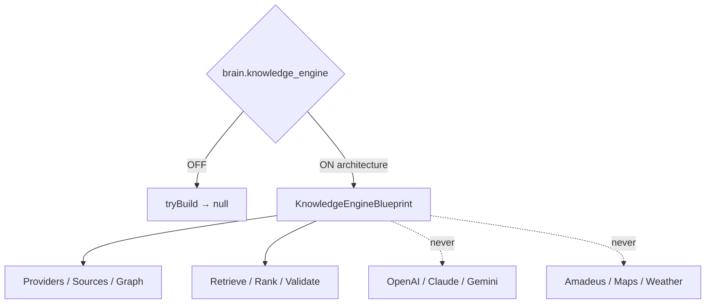

# AI Knowledge Engine — Phase 6 Stage 6

**Status:** Architecture only · Flag `brain.knowledge_engine` **default OFF**  
**Depends on:** `brain.memory_engine`  
**Freeze:** LLMs · APIs · Amadeus · Maps · Weather APIs · DB · Vector DB · Search backend · Storage · Runtime · Business logic · prior PRs.

Complete Knowledge Engine architecture for travel knowledge domains.  
**Blueprints only. No implementation.**

## Package

`src/lib/orchestration/knowledgeEngine/`

## Created (contracts)

Knowledge Engine · Pipeline · Registry · Providers · Sources · Documents · Entities · Categories · Graph · References · Context · Retrieval · Ranking · Resolution · Validation · Freshness · Confidence · Provenance · Cache · Events · Analytics · Audit Trail · State Machine

## Coverage domains

Destination · Country · Visa · Airline · Airport · Hotel · Activity · Transportation · Travel rules/restrictions · Weather/Currency/Language/Timezone/Culture references · Emergency · FAQ · Policy

Force blueprint: `tryBuildKnowledgeEngineBlueprint({ enabled: true })`.
