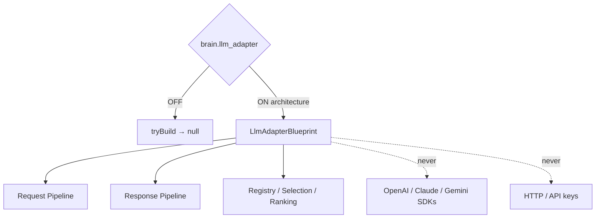

# AI LLM Adapter Layer — Phase 6 Stage 8

**Status:** Architecture only · Flag `brain.llm_adapter` **default OFF**  
**Depends on:** `brain.tool_engine`  
**Freeze:** OpenAI/Claude/Gemini SDKs · API keys · HTTP · Runtime · Streaming · Auth · DB · Redis · Supabase · Firebase · Storage · Business logic · prior PRs.

Provider-agnostic LLM Adapter Layer so Rahhal can target multiple AI providers without changing business architecture.  
**Blueprints only. No implementation.**

## Package

`src/lib/orchestration/llmAdapter/`

## Created (contracts)

LLM Adapter · Registry · Provider Contracts · Provider Interface · Request Pipeline · Response Pipeline · Context Builder · Prompt Builder · System Prompt · Tool Call · Function Call · Streaming · Response Normalizer · Error Model · Retry · Timeout · Cost Model · Token Accounting · Provider Selection · Provider Ranking · Analytics · Audit Trail · Events · State Machine

## Future providers (catalog only)

OpenAI · Claude · Gemini · Azure OpenAI · OpenRouter · Local Models · Future Providers

Force blueprint: `tryBuildLlmAdapterBlueprint({ enabled: true })`.

See also: `AI_PROVIDER_INTERFACE.md`, `AI_PROVIDER_REGISTRY.md`, `AI_PROMPT_PIPELINE.md`, `AI_RESPONSE_PIPELINE.md`, `AI_EVOLUTION_PHASE6_STAGE8.md`.
