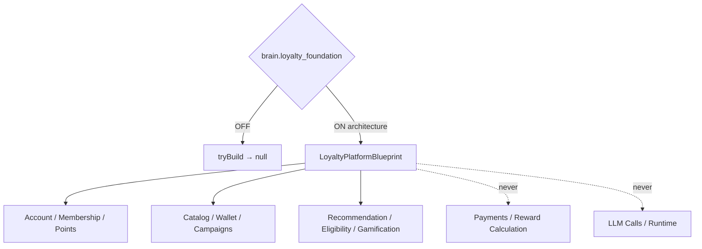

# Loyalty Platform Foundation — Phase 7 Stage 2

**Status:** Architecture only · Flag `brain.loyalty_foundation` **default OFF**  
**Depends on:** `brain.traveler_profile`  
**Distinct from:** Sprint 38 flag `brain.loyalty_platform` (executable loyalty layer)  
**Freeze:** Database · Auth · Payments · Coupons logic · Reward calculation · Business logic · HTTP · Streaming · Runtime · APIs · LLM · prior PRs.

Complete loyalty platform foundation for future rewards, memberships, AI incentives, referrals, campaigns, achievements, and partner ecosystems.  
**Blueprints only. No implementation.**

## Package

`src/lib/orchestration/loyaltyPlatformFoundation/`

## Created (contracts)

Loyalty Account · Membership Levels/Status · Reward Points · Point Ledger · Point Expiration · Reward Catalog/Redemption · Travel Achievements · Badges · Milestones · Referral Program/Rewards · Partner Rewards · Travel Credits · Coupons · Promo/Voucher/Campaign Registries · Loyalty Wallet · Reward History/Timeline · Audit · Analytics · Insights

## AI loyalty capabilities

Reward Recommendation · Offer Personalization · Reward Eligibility · Campaign Decision · Gamification Strategy

Force blueprint: `tryBuildLoyaltyPlatformBlueprint({ enabled: true })`.

See also: `AI_LOYALTY_ARCHITECTURE.md`, `AI_REWARD_ENGINE.md`, `AI_GAMIFICATION.md`, `AI_LOYALTY_VALIDATION.md`, `AI_EVOLUTION_PHASE7_STAGE2.md`.
