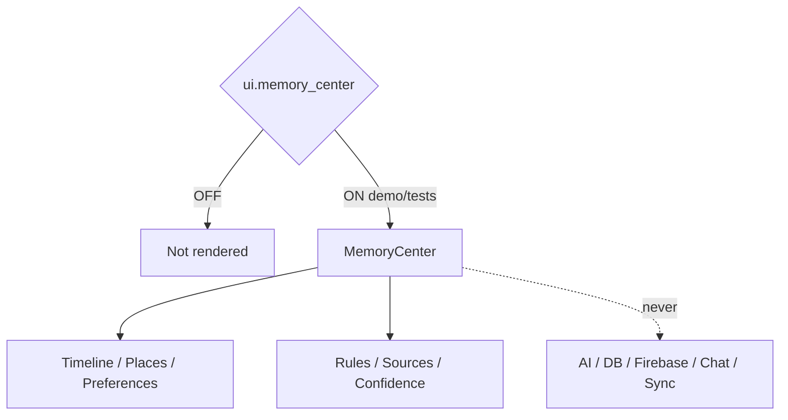

# AI Memory & Knowledge Center — Phase 5 Stage 5

**Status:** Additive presentation · Flag `ui.memory_center` **default OFF**  
**Depends on:** `ui.application_shell`  
**Freeze:** Production · AI · Runtime · Database · Firebase · Chat · Auth · Sync · Storage · Search backend · prior PRs.

Premium Memory & Knowledge Center — **presentation and placeholders only**.

## Sections

Overview · Memory Timeline · Known Destinations · Favorite Countries/Cities/Hotels/Airlines · Travel / Seat / Meal Preferences · Budget History · Family / Emergency Contacts · Passports · Visa History · Saved Places/Trips · Conversation Memories · Custom Rules · Always Do · Never Do · Knowledge Sources · Confidence Scores · Memory Categories · Search · Filters · Bookmarks · Edit/Delete placeholders

## Visuals

Knowledge cards · Timeline · Confidence meter · Memory graph · Category chips · Source badges · Relationship cards · Progress indicators

Force-render: `<MemoryCenter enabled />`.
