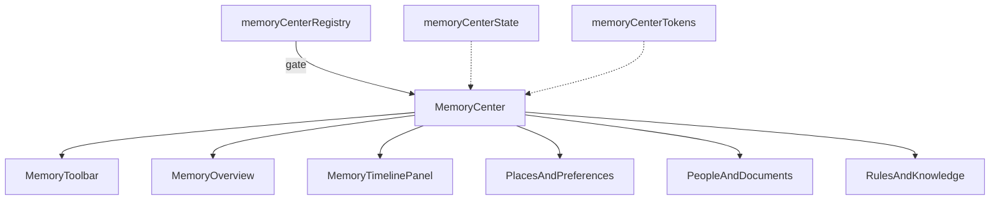

# Memory & Knowledge Center — Architecture Notes

**Package:** `src/ui/memoryCenter/`

| Concern | Status |
|---------|--------|
| Production routes | Not mounted |
| AI / Runtime / Database / Firebase / Chat | Not wired |
| Auth / Sync / Storage / Search backend | None |
| Backend / realtime | None |
| RTL + light/dark + reduced motion | Yes |
