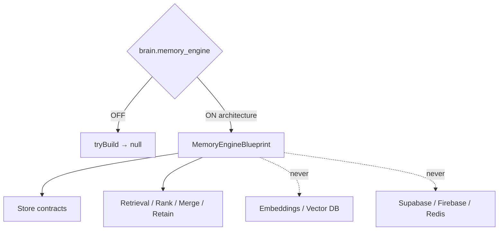

# AI Memory Engine — Phase 6 Stage 5

**Status:** Architecture only · Flag `brain.memory_engine` **default OFF**  
**Depends on:** `brain.decision_engine`  
**Freeze:** LLMs · Embeddings · Vector DB · Database · Supabase · Firebase · Redis · Storage · Runtime · Business logic · prior PRs.

Manages conversational and long-term travel memory via **contracts and blueprints only**.  
**No implementation. No persistence. No embeddings.**

## Package

`src/lib/orchestration/memoryEngine/`

## Created (contracts)

Memory Engine · Pipeline · Context · Session · Registry · Events · State Machine · Store Contracts · Conversation / Session / Profile / Preference / Destination / Trip History / Document / Relationship / Entity Memory · Knowledge References · Retrieval Strategy · Ranking · Merge Strategy · Lifecycle · Retention Policy · Confidence Model · Audit Trail · Analytics

Force blueprint: `tryBuildMemoryEngineBlueprint({ enabled: true })`.
