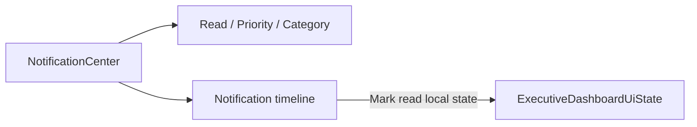

# Notification Center — Phase 4 Stage 6

Part of `src/ui/executiveDashboard/notificationCenter`.

## Capabilities (UI only)

- Timeline list of presentation notifications  
- Unread / Read filters  
- Priority: normal · priority · critical · reminder  
- Categories: travel updates · flight/hotel/meeting/transport changes · weather placeholder · visa placeholder · system messages  

## Explicit non-goals

No push notifications · no realtime sockets · no Firebase · no backend delivery · no API polling.

