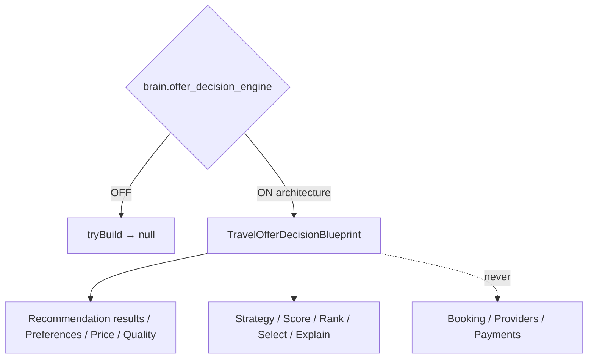

# Offer Decision Engine — Phase 7 Stage 10

**Status:** Architecture only · Flag `brain.offer_decision_engine` **default OFF**  
**Depends on:** `brain.travel_recommendation`  
**Package:** `src/lib/orchestration/travelOfferDecisionEngine/`  
**Distinct from:** Stage 9 `brain.travel_recommendation` · Stage 3 `brain.personalization_engine` · `ai.recommendation_engine`  
**Freeze:** Runtime · LLM · Provider APIs · Booking · Payments · Pricing · HTTP · OCR · Auth · Database · Storage · prior PRs.

Selects the **best offer** from recommendation results by balancing price, quality, traveler preferences, and business rules — with multi-strategy support, explanation, confidence, and validation lifecycle.

**NEVER books. NEVER contacts providers. NEVER calculates payments. NEVER executes recommendations. Offer decision architecture only.**

## Created (contracts)

Offer Decision Engine · Pipeline · Schema · Strategy · Scoring · Ranking · Explanation · Confidence · Validation · Lifecycle · Snapshot · Revision

## Output contracts

`OfferCandidate` · `OfferBundle` · `OfferDecision` · `OfferRanking` · `OfferScore` · `OfferExplanation` · `OfferConfidence` · `OfferValidation` · `OfferRevision` · `OfferSnapshot`

Force blueprint: `tryBuildTravelOfferDecisionBlueprint({ enabled: true })`.

See also: `AI_OFFER_PIPELINE.md`, `AI_OFFER_SCHEMA.md`, `AI_OFFER_STRATEGY.md`, `AI_OFFER_SCORING.md`, `AI_OFFER_RANKING.md`, `AI_OFFER_EXPLANATION.md`, `AI_OFFER_VALIDATION.md`, `AI_EVOLUTION_PHASE7_STAGE10.md`.
