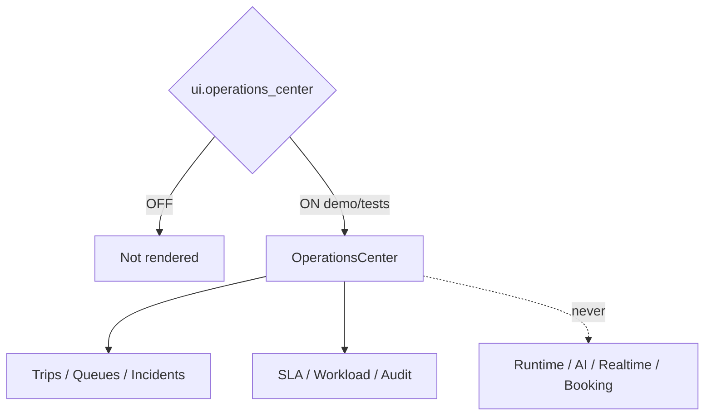

# Operations Center — Phase 5 Stage 7

**Status:** Additive presentation · Flag `ui.operations_center` **default OFF**  
**Depends on:** `ui.application_shell`  
**Freeze:** Production · AI · Runtime · Realtime · Database · Firebase · Notifications · Booking APIs · Maps · Payments · Auth · prior PRs.

Premium Operations Center — **presentation and placeholders only**.

## Sections

Overview · Active / Upcoming / Delayed Trips · Traveler Requests · Support Queue · Incident Center · Emergency Dashboard · Approval / Booking / Visa Queues · Provider Status · SLA Metrics · Agent Workload · Notifications Queue · Activity Feed · Audit Timeline · Search · Filters · Priority · Risk · Calendar · Map Placeholder

## Components

Metrics cards · Status chips · Timeline · Queue / Incident / Traveler / Provider cards · Progress bars · Charts placeholders

Force-render: `<OperationsCenter enabled />`.
