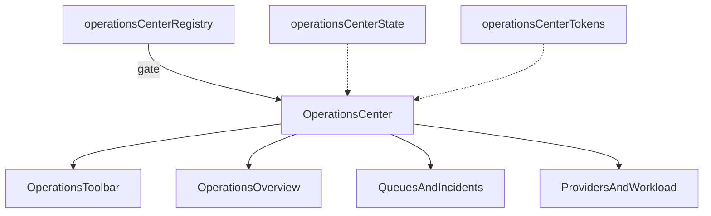

# Operations Center — Architecture Notes

**Package:** `src/ui/operationsCenter/`

| Concern | Status |
|---------|--------|
| Production routes | Not mounted |
| Runtime / AI / Realtime | Not wired |
| Database / Firebase / Notifications | Not wired |
| Booking APIs / Maps / Payments / Auth | Not wired |
| RTL + light/dark + reduced motion | Yes |
