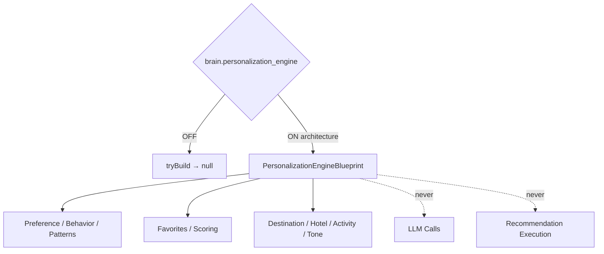

# AI Personalization Engine — Phase 7 Stage 3

**Status:** Architecture only · Flag `brain.personalization_engine` **default OFF**  
**Depends on:** `brain.loyalty_foundation`  
**Distinct from:** `ai.personalization` · `ai.recommendation_engine` · `ai.traveler_personalization`  
**Freeze:** LLM · Recommendation execution · Database · Runtime · Streaming · HTTP · Auth · Business logic · APIs · prior PRs.

Personalization Engine architecture that learns (declaratively) from traveler profile, loyalty, conversations, behavior, history, and context.  
**Blueprints only. No implementation.**

## Package

`src/lib/orchestration/personalizationEngine/`

## Created (contracts)

Personalization Engine · Profile · Preference/Behavior Learning · Travel Pattern Analysis · Intent Prediction · Recommendation/Personalization Context · Dynamic Segments · Personas · Preference Confidence/Ranking · Interest Detection · Seasonality · Location/Budget/Companion Awareness · Travel History · Favorite Rankings (destination/activity/hotel/airline/restaurant) · Recommendation Scoring/Feedback · Timeline · Audit

## AI personalization capabilities

Destination · Hotel · Activity · Restaurant · Transportation · Conversation Tone · Offer Personalization

Force blueprint: `tryBuildPersonalizationEngineBlueprint({ enabled: true })`.

See also: `AI_PERSONALIZATION_ARCHITECTURE.md`, `AI_RECOMMENDATION_ENGINE.md`, `AI_BEHAVIOR_MODEL.md`, `AI_PREFERENCE_MODEL.md`, `AI_PERSONALIZATION_VALIDATION.md`, `AI_EVOLUTION_PHASE7_STAGE3.md`.
