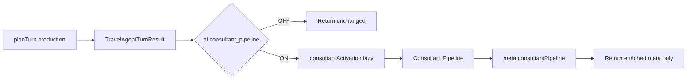

# AI Pipeline Activation Report — Stage 2

**Branch:** `cursor/ai-integration-stage2-pipeline-activation-7518`  
**Base:** Stage 1 consultant-pipeline branch  
**Scope:** Safe activation of Consultant Pipeline after `planTurn`  
**Merge:** Do **not** merge (draft PR only). Do **not** modify previous PRs.

---

## Verdict

Stage 2 wires the existing Consultant Pipeline into production `planTurn` as a **post-planning, read-only enrichment**. Flag **`ai.consultant_pipeline` remains OFF by default**. While OFF, production behavior is unchanged (sync gate, no pipeline import). While ON, planning outputs are preserved and `meta.consultantPipeline` carries enrichment + telemetry.

---

## Activation architecture

---

## Performance report

| Metric | Flag OFF | Flag ON |
|--------|----------|---------|
| Extra imports | None | Dynamic `consultantActivation` + pipeline stages |
| Extra network / LLM | None | None |
| Planning mutation | None | None |
| Observed activation tests | Instant no-op | Pipeline stage timings recorded in telemetry |

Telemetry fields (no PII):

- `totalDurationMs`
- `stageTimings`
- `confidence`
- `clarificationCount`
- `success` / `failureCode`
- `stageCount`

---

## Safety validation

| Rule | Result |
|------|--------|
| OFF → identical production path | Covered by activation tests |
| ON → reply / tripPlan identity preserved | Covered |
| ON → destinations not rewritten | Covered |
| Fail open on pipeline error | Implemented in `enrichTurnWithConsultantPipeline` |
| No PII in telemetry | Covered |

---

## Files added / modified

### Added

| Path | Role |
|------|------|
| `src/lib/agent/orchestrator/consultantActivation.ts` | Read-only planTurn enrichment |
| `src/lib/agent/orchestrator/consultantTelemetry.ts` | Metrics store |
| `src/lib/__tests__/consultantPipeline.stage2.activation.test.ts` | Activation tests |
| `AI_INTEGRATION_STAGE2.md` | Activation architecture |
| `AI_PIPELINE_ACTIVATION.md` | This report |

### Modified

| Path | Change |
|------|--------|
| `src/lib/agent/travelAgentService.ts` | Optional `planTurn` wrapper + `consultantPipelineEnabled` option |
| `src/lib/agent/types.ts` | `AgentProviderMeta.consultantPipeline` |
| `src/lib/agent/orchestrator/index.ts` | Export activation + telemetry |
| `src/lib/agent/index.ts` | Re-exports |
| `src/lib/ai/featureFlags/featureRegistry.ts` | Notes for Stage 2 |
| `FEATURE_REGISTRY.md` | Document Stage 2 behavior |
| Stage 1 comments | Reflect optional Stage 2 wiring |

---

## Validation commands

- `npm run lint` — pass
- `npm run typecheck` — pass
- `npm run arch:circular` — pass
- `npm run test:run` — full suite + 8 Stage 2 activation tests

---

## Future

1. Optional Conversation Brain fact injection from `meta.consultantPipeline` (still no plan mutation).  
2. UI surfacing of strategy / trade-offs behind the same flag.  
3. Keep default OFF until clarification UX is reviewed.

---

## Explicit non-goals (honored)

- No algorithm / intelligence changes  
- No production mutation  
- No merge / no rebase of prior PRs
