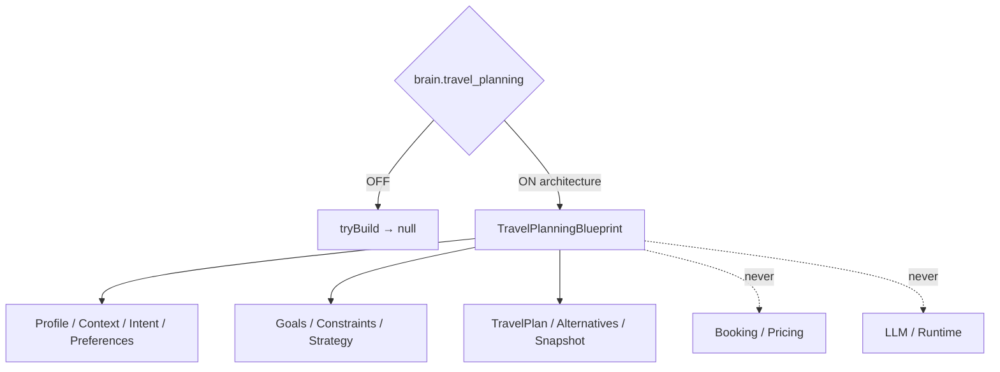
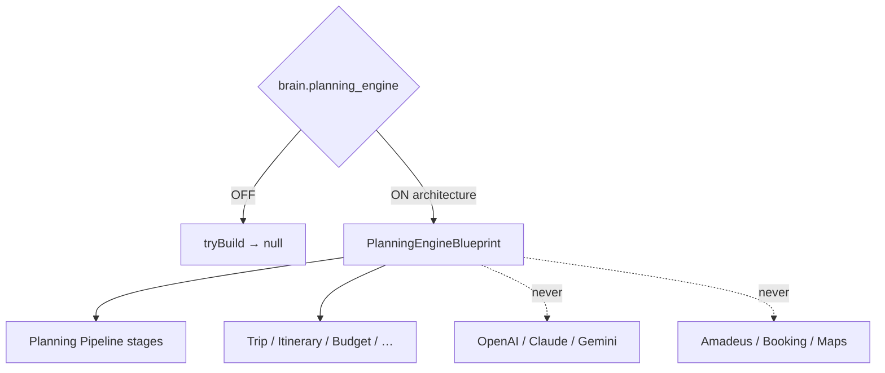

# AI Travel Planning Engine — Phase 7 Stage 7

**Status:** Architecture only · Flag `brain.travel_planning` **default OFF**  
**Depends on:** `brain.intent_engine`  
**Distinct from:** Phase 6 `brain.planning_engine`  
**Freeze:** Runtime · LLM · Booking · Pricing · External APIs · Database · Storage · Business logic · prior PRs.

Transforms traveler profile, conversation context, intent, preferences, budget, dates, and destination into a **structured travel planning blueprint**.  
**Never books anything. Structures only.**

## Package

`src/lib/orchestration/travelPlanningEngine/`

## Created (contracts)

Planning Engine · Pipeline · Schema · Validation · Lifecycle · Strategy · Constraints · Goals · Priorities · Rules · Timeline · Snapshot · Confidence · Revision · Version · Alternatives · Optimization

## Output contracts

`TravelPlan` · `PlanningGoal` · `PlanningConstraint` · `PlanningStep` · `PlanningAlternative` · `PlanningScore` · `PlanningConfidence` · `PlanningValidation` · `PlanningRevision` · `PlanningSnapshot`

Force blueprint: `tryBuildTravelPlanningBlueprint({ enabled: true })`.

See also: `AI_PLANNING_PIPELINE.md`, `AI_PLANNING_SCHEMA.md`, `AI_PLANNING_CONSTRAINTS.md`, `AI_PLANNING_STRATEGY.md`, `AI_PLANNING_VALIDATION.md`, `AI_EVOLUTION_PHASE7_STAGE7.md`.

---

# AI Planning Engine — Phase 6 Stage 3

**Status:** Architecture only · Flag `brain.planning_engine` **default OFF**  
**Depends on:** `brain.conversation_orchestrator`  
**Freeze:** LLMs · Runtime · Booking APIs · Amadeus · Maps · Weather · Payments · Firebase · Supabase · Realtime · Notifications · Auth · Business logic · prior PRs.

Converts conversation context into **structured travel plan contracts**.  
**No planning execution. No AI reasoning. No LLM implementation.**

## Package

`src/lib/orchestration/planningEngine/`

## Created (contracts)

Planning Engine · Planning Pipeline · Trip Planner · Destination Selector · Itinerary Generator · Budget Planner · Schedule Optimizer · Transportation / Accommodation / Activity Planners · Risk Analyzer · Constraint Engine · Preference Matcher · Alternative Generator · Scenario Builder · Planning Context · Planning Session · Planning Registry · Planning Events · Planning Analytics · Planning State Machine · Planning Confidence Model

Force blueprint: `tryBuildPlanningEngineBlueprint({ enabled: true })`.
