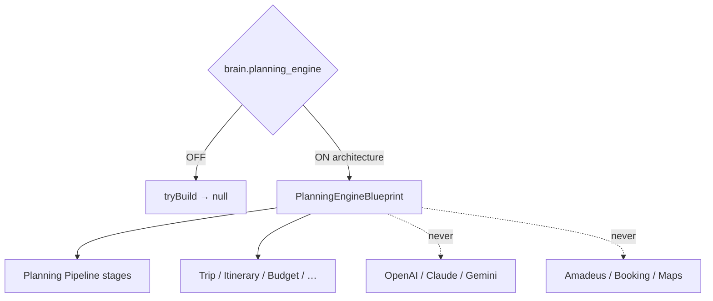

# AI Planning Engine — Phase 6 Stage 3

**Status:** Architecture only · Flag `brain.planning_engine` **default OFF**  
**Depends on:** `brain.conversation_orchestrator`  
**Freeze:** LLMs · Runtime · Booking APIs · Amadeus · Maps · Weather · Payments · Firebase · Supabase · Realtime · Notifications · Auth · Business logic · prior PRs.

Converts conversation context into **structured travel plan contracts**.  
**No planning execution. No AI reasoning. No LLM implementation.**

## Package

`src/lib/orchestration/planningEngine/`

## Created (contracts)

Planning Engine · Planning Pipeline · Trip Planner · Destination Selector · Itinerary Generator · Budget Planner · Schedule Optimizer · Transportation / Accommodation / Activity Planners · Risk Analyzer · Constraint Engine · Preference Matcher · Alternative Generator · Scenario Builder · Planning Context · Planning Session · Planning Registry · Planning Events · Planning Analytics · Planning State Machine · Planning Confidence Model

Force blueprint: `tryBuildPlanningEngineBlueprint({ enabled: true })`.
