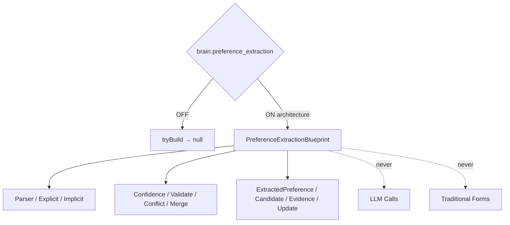

# AI Smart Preference Extraction Engine — Phase 7 Stage 4

**Status:** Architecture only · Flag `brain.preference_extraction` **default OFF**  
**Depends on:** `brain.personalization_engine`  
**Freeze:** LLM · Database · Storage · Runtime · Recommendation execution · HTTP · Business logic · APIs · prior PRs.

Extracts traveler preferences automatically from natural conversations — no traditional forms.  
**Blueprints only. No implementation.**

## Package

`src/lib/orchestration/preferenceExtractionEngine/`

## Created (contracts)

Preference Extraction Engine · Conversation Preference Parser · Implicit/Explicit Detectors · Confidence Model · Conflict Resolver · Freshness Model · Timeline · Revision History · Sources · Merge Strategy · Validation Rules · Confidence Score · Weighting · Expiration · Categories · per-category preference contracts

## Output contracts

`ExtractedPreference` · `PreferenceCandidate` · `PreferenceEvidence` · `PreferenceConfidence` · `PreferenceValidation` · `PreferenceUpdate`

Force blueprint: `tryBuildPreferenceExtractionBlueprint({ enabled: true })`.

See also: `AI_PREFERENCE_PIPELINE.md`, `AI_CONVERSATION_PREFERENCE.md`, `AI_PREFERENCE_SCHEMA.md`, `AI_PREFERENCE_CONFIDENCE.md`, `AI_PREFERENCE_VALIDATION.md`, `AI_EVOLUTION_PHASE7_STAGE4.md`.
