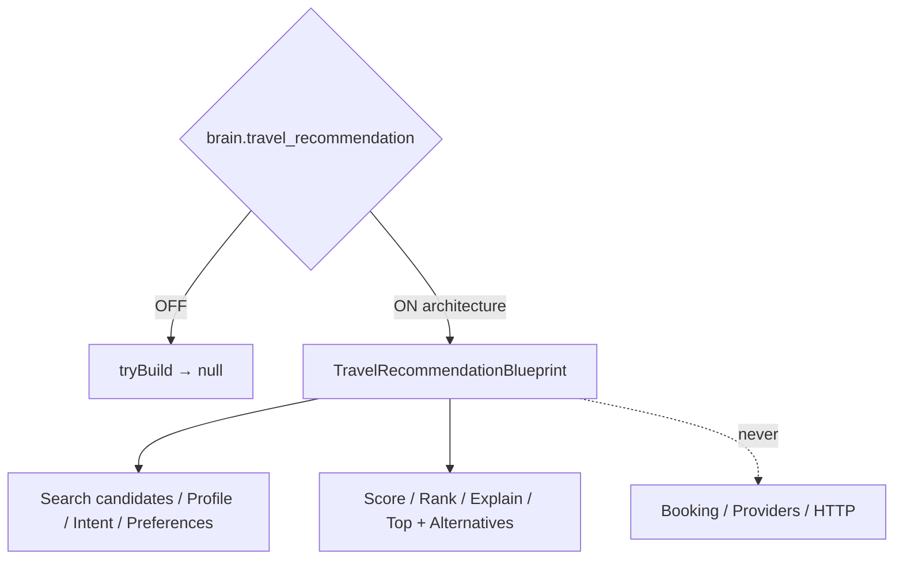

# Travel Ranking & Recommendation Engine — Phase 7 Stage 9

**Status:** Architecture only · Flag `brain.travel_recommendation` **default OFF**  
**Depends on:** `brain.search_orchestrator`  
**Package:** `src/lib/orchestration/travelRecommendationEngine/`  
**Distinct from:** Phase 7 Stage 3 `brain.personalization_engine` (section below) · Sprint 6 `ai.recommendation_intelligence` · legacy `ai.recommendation_engine`  
**Freeze:** Runtime · LLM · Provider APIs · Booking · Pricing · HTTP · Database · Storage · prior PRs.

Receives **normalized search candidates** from the Search Orchestrator and ranks them by traveler profile, conversation context, intent, preferences, budget, planning goals, travel constraints, historical signals, and business rules.

**NEVER books. NEVER contacts providers. Recommendation architecture only.**

## Created (contracts)

Recommendation Engine · Pipeline · Schema · Strategy · Ranking · Scoring · Confidence · Validation · Lifecycle · Snapshot · Revision · Explanation

## Output contracts

`RecommendationCandidate` · `RecommendationScore` · `RecommendationRanking` · `RecommendationReason` · `RecommendationConfidence` · `RecommendationValidation` · `RecommendationSnapshot` · `RecommendationRevision` · `TopRecommendation` · `AlternativeRecommendation`



Force blueprint: `tryBuildTravelRecommendationBlueprint({ enabled: true })`.

See also: `AI_RECOMMENDATION_PIPELINE.md`, `AI_RECOMMENDATION_SCHEMA.md`, `AI_RECOMMENDATION_RANKING.md`, `AI_RECOMMENDATION_SCORING.md`, `AI_RECOMMENDATION_VALIDATION.md`, `AI_EVOLUTION_PHASE7_STAGE9.md`.

---

# Recommendation Engine — Phase 7 Stage 3 (architecture)

**Status:** Architecture only · Flag `brain.personalization_engine` **default OFF**  
**Package:** `src/lib/orchestration/personalizationEngine/`  
**Distinct from:** Sprint 6 `ai.recommendation_intelligence` (section below) · legacy `ai.recommendation_engine`

**There is no recommendation execution in this stage.**

## Scoring & feedback

| Contract | Blueprint defaults |
|----------|-------------------|
| `RecommendationScoringContract` | `executed: false`, empty score hints |
| `RecommendationFeedbackContract` | empty feedback hints |
| `RecommendationContextContract` | source key hints only |

## Capability contracts

| Contract | Role |
|----------|------|
| `DestinationRecommendationContract` | Destination keys (empty) |
| `HotelRecommendationContract` | Hotel keys |
| `ActivityRecommendationContract` | Activity keys |
| `RestaurantRecommendationContract` | Restaurant keys |
| `TransportationRecommendationContract` | Transport keys |
| `ConversationTonePersonalizationContract` | Tone hints |
| `OfferPersonalizationContract` | Offer keys |

See `AI_PERSONALIZATION_ENGINE.md`, `AI_EVOLUTION_PHASE7_STAGE3.md`.

---

# AI Recommendation Engine — Evolution Sprint 6

**Status:** Additive foundation · **Not** wired into `planTurn` · Flag `ai.recommendation_intelligence` **default OFF**  
**Freeze:** Decision Engine · Planning Draft · Conversation Brain · Smart Clarification · Production Authority · `planTurn` · Reasoning · Reflection · PlanningGraph · Traveler Intelligence sources remain untouched.

This layer turns plan candidates into **expert consultant recommendations**: explain, compare, justify, challenge assumptions, and surface highest-value decisions — not mere ranking.

---

## 1. Recommendation pipeline

```
RecommendationCandidate[] (+ optional travelerHints / refs)
        │
        ▼
 RecommendationEvidence.collect   (known fields only)
        │
        ▼
 RecommendationScorer
   ├─ ValueAnalyzer
   ├─ BenefitEvaluator
   ├─ RiskEvaluator
   ├─ TradeoffEvaluator
   └─ OpportunityCostAnalyzer
        │
        ▼
 Impact assessments (budget / comfort / time / travel quality)
        │
        ▼
 AlternativeGenerator + DecisionJustifier + ConfidenceExplainer
        │
        ▼
 RecommendationBuilder → RecommendationPackage
        │
        ▼
 RecommendationNarrative → Executive / Short / Detailed / Consultant
        │
        ▼
 RecommendationEngine (+ Comparator, Revision, Summary)
```

**Invariant:** Never invent facts. Unknown budget/destination/duration → provisional language + missing information + questions.

---

## 2. Evidence weighting

Evidence items are harvested only from candidate-known fields:

| Source | Weight (typical) |
|--------|------------------|
| `candidate.evidence[]` | 1.0 |
| Stated destinations | 0.9 |
| Known budget amount | 0.85 |
| Known duration | 0.7 |
| Branch `whyExists` | 0.6 |

Composite confidence blends candidate confidence, missing-data load, and evidence breadth.

---

## 3. Tradeoff & opportunity generation

- **Tradeoffs** — from candidate `tradeoffs` + hard-constraint density + fixed dates.
- **Opportunity cost** — destinations/scores present on peer candidates but not on the primary.
- **Risks** — stated risk notes + low risk-tolerance conflict + missing-info load.
- **Benefits** — stated destinations, duration, purpose, hard-constraint clarity.

---

## 4. Confidence explanation

`ConfidenceExplainer` states:

- Overall % confidence  
- Evidence count & candidate count  
- Which missing fields limit confidence  
- Whether to **collect information** vs provisional recommend  

Actions: `recommend` · `compare` · `collect_information` · `challenge_assumption` · `defer`

---

## 5. Recommendation formats

| Format | Content |
|--------|---------|
| **Executive** | Headline, one-liner, confidence %, action, top risk, next step |
| **Short** | Title, why, why-not, confidence, top missing |
| **Detailed** | Full package as titled sections (why, risks, impacts, questions, …) |
| **Consultant** | Voice + justification + confidence explanation + assumption challenges |

Every package also includes: primary recommendation, benefits, risks, trade-offs, opportunity cost, budget/comfort/time/quality impacts, evidence, missing information, and confidence-improving questions.

---

## 6. API

| Entry | Role |
|-------|------|
| `RecommendationEngine.run` / `tryRun` | Full pipeline (gated) |
| `RecommendationBuilder.build` | Package only |
| `RecommendationRevision.revise` | Link to prior package |
| `RecommendationComparator` | Pairwise candidate / package compare |
| `isRecommendationIntelligenceEnabled` | Feature gate |

Candidates are duck-typed — Planning Graph nodes can be mapped without modifying PlanningGraph.

---

## 7. Performance / production

| Concern | Sprint 6 |
|---------|----------|
| Network / LLM / API | **None** |
| planTurn wiring | **None** |
| Default flag | **OFF** |
| Runtime chat | **Unchanged** |
| CPU | In-memory scoring O(n²) pairwise compares for small n |

---

## 8. Tests

`src/lib/__tests__/recommendationIntelligence.sprint6.test.ts` — Arabic, English, low confidence, conflicting constraints, multiple plans, revision, regression.
