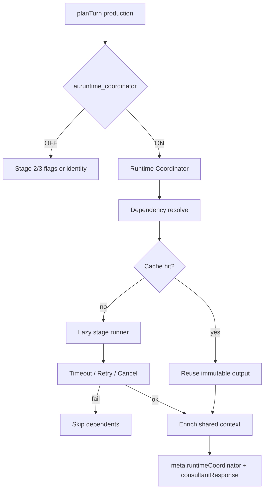

# AI Runtime — Stage 4 Report

**Branch:** `cursor/ai-integration-stage4-runtime-coordinator-7518`  
**Base:** Stage 3 unified-response branch  
**Scope:** AI Runtime Coordinator (execution orchestration only)  
**Merge:** Do **not** merge (draft PR only). Do **not** modify previous PRs.

---

## Verdict

Stage 4 delivers an offline **Runtime Coordinator** that orders, caches, times out, retries, and isolates consultant intelligence stages behind `ai.runtime_coordinator` (default **OFF**). Production planning is unchanged while OFF. While ON, layers execute through the coordinator and enrich `meta` only.

---

## Runtime architecture

---

## Performance report

| Mode | Cost |
|------|------|
| Flag OFF | Sync registry check only |
| Flag ON (cold) | Lazy imports + stage runners (CPU) |
| Flag ON (warm cache) | Cache hits; no duplicate stage work |
| Network / LLM | None |
| Planning mutation | None |

Telemetry fields (no PII):

- `executionOrder`
- `stageDurations`
- `cacheHits` / `cacheMisses`
- `retries` / `timeouts` / `failures`
- `totalDurationMs`

---

## Runtime report

| Capability | Covered |
|------------|---------|
| Execution ordering | Yes — topological |
| Dependency resolution | Yes — `RUNTIME_DEPENDENCIES` |
| Shared context | Yes — write-once bags |
| Runtime cache | Yes — session + context hash |
| Lazy execution | Yes — dynamic imports |
| Cancellation | Yes — `AbortSignal` |
| Timeout handling | Yes — per-stage + fault inject |
| Retry policy | Yes — `maxRetries` |
| Error isolation | Yes — skip dependents |
| Performance monitoring | Yes — telemetry store |

---

## Files

### Added

| Path | Role |
|------|------|
| `src/lib/agent/orchestrator/runtime/*` | Coordinator package |
| `src/lib/__tests__/runtimeCoordinator.stage4.test.ts` | Coordinator / cache / isolation / timeout tests |
| `AI_RUNTIME_COORDINATOR.md` | Architecture |
| `AI_RUNTIME.md` | This report |

### Modified

| Path | Change |
|------|--------|
| `travelAgentService.ts` | Prefer runtime path when flag ON |
| Feature registry / types / `FEATURE_REGISTRY.md` | `ai.runtime_coordinator` |
| `AgentProviderMeta` | `runtimeCoordinator` snapshot |
| Orchestrator / agent barrels | Additive exports |

---

## Validation

- `npm run lint`
- `npm run typecheck`
- `npm run arch:circular`
- `npm run test:run`

---

## Explicit non-goals (honored)

- No production planning / engine modifications  
- No existing test edits  
- No merge / no rebase of prior PRs
