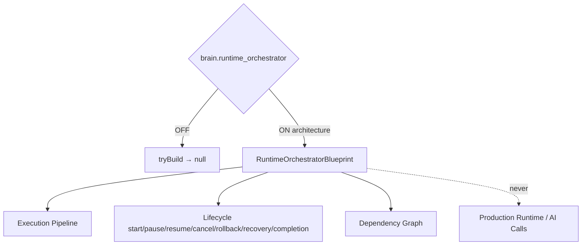

# AI Runtime Orchestrator — Phase 6 Stage 9

**Status:** Architecture only · Flag `brain.runtime_orchestrator` **default OFF**  
**Depends on:** `brain.llm_adapter`  
**Freeze:** Production runtime · AI calls · OpenAI/Claude/Gemini · HTTP · Streaming · DB · Redis · Supabase · Firebase · Storage · Auth · Tool execution · Business logic · prior PRs.

Coordinates all Phase 6 AI engines into one unified execution architecture.  
**Blueprints only. No implementation.**

## Package

`src/lib/orchestration/runtimeOrchestrator/`

## Connected engines (references only)

| Engine | Feature hint |
|--------|--------------|
| Conversation Orchestrator | `brain.conversation_orchestrator` |
| Planning Engine | `brain.planning_engine` |
| Decision Engine | `brain.decision_engine` |
| Memory Engine | `brain.memory_engine` |
| Knowledge Engine | `brain.knowledge_engine` |
| Tool Engine | `brain.tool_engine` |
| LLM Adapter | `brain.llm_adapter` |

## Created (contracts)

Runtime Orchestrator · Execution Pipeline · Context · Lifecycle · Session · Coordinator · Scheduler · Queue · State Machine · Events · Registry · Contracts · Middleware · Hooks · Guards · Recovery · Retry · Timeout · Metrics · Analytics · Audit · Logging · Monitoring · Trace Model · Dependency Graph

Force blueprint: `tryBuildRuntimeOrchestratorBlueprint({ enabled: true })`.

See also: `AI_EXECUTION_PIPELINE.md`, `AI_RUNTIME_ARCHITECTURE.md`, `AI_EXECUTION_LIFECYCLE.md`, `AI_EXECUTION_CONTRACTS.md`, `AI_EVOLUTION_PHASE6_STAGE9.md`.
