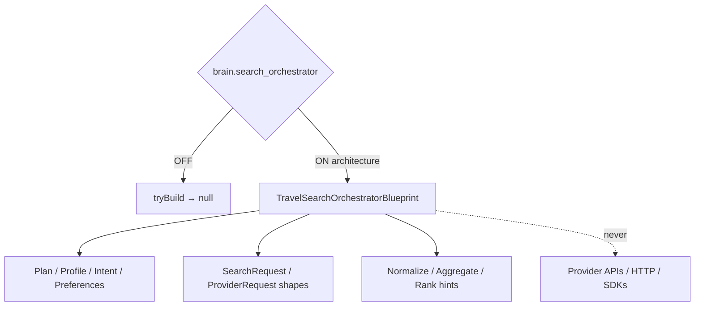

# Travel Search Orchestrator — Phase 7 Stage 8

**Status:** Architecture only · Flag `brain.search_orchestrator` **default OFF**  
**Depends on:** `brain.travel_planning`  
**Distinct from:** Sprint 24 `brain.search`  
**Freeze:** Runtime · HTTP · SDKs · Provider APIs · Database · Storage · Booking · Pricing · LLM · prior PRs.

Receives travel plan, profile, context, intent, preferences, budget, dates, and destination — prepares **unified search requests** for future providers.  
**NEVER calls providers. Orchestration architecture only.**

## Package

`src/lib/orchestration/travelSearchOrchestrator/`

## Created (contracts)

Travel Search Orchestrator · Search Pipeline · Schema · Contracts · Validation · Lifecycle · Provider Abstraction · Strategy · Ranking · Normalization · Aggregation · Confidence · Snapshot · Revision

## Output contracts

`SearchRequest` · `SearchCandidate` · `ProviderRequest` · `ProviderResponse` · `SearchResult` · `SearchRanking` · `SearchScore` · `SearchValidation` · `SearchSnapshot` · `SearchRevision`

Force blueprint: `tryBuildTravelSearchOrchestratorBlueprint({ enabled: true })`.

See also: `AI_SEARCH_PIPELINE.md`, `AI_SEARCH_SCHEMA.md`, `AI_PROVIDER_ABSTRACTION.md`, `AI_SEARCH_RANKING.md`, `AI_SEARCH_VALIDATION.md`, `AI_EVOLUTION_PHASE7_STAGE8.md`.
