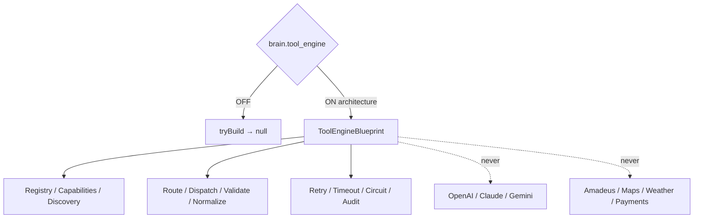

# AI Tool Execution Engine — Phase 6 Stage 7

**Status:** Architecture only · Flag `brain.tool_engine` **default OFF**  
**Depends on:** `brain.knowledge_engine`  
**Freeze:** LLMs · APIs · Amadeus · Maps · Weather APIs · Firebase · Supabase · Redis · DB · Storage · Runtime · Business logic · prior PRs.

Complete Tool Execution Engine architecture for future travel and platform tools.  
**Blueprints only. No implementation.**

## Package

`src/lib/orchestration/toolEngine/`

## Created (contracts)

Tool Execution Engine · Tool Registry · Tool Contracts · Tool Router · Tool Dispatcher · Tool Resolver · Tool Capability Registry · Tool Discovery · Tool Metadata · Tool Permissions · Tool Policies · Tool Context Injection · Tool Input Validation · Tool Output Validation · Tool Result Normalization · Tool Error Model · Tool Retry Strategy · Tool Timeout Strategy · Tool Circuit Breaker · Tool Queue · Tool Events · Tool Analytics · Tool Audit Trail · Tool State Machine · Tool Execution Pipeline

## Future capabilities (catalog only)

Flight Search · Hotel Search · Activity Search · Visa Services · Weather · Maps · Currency · Calendar · Email · WhatsApp · Notifications · Payments · Booking APIs · CRM · Document Processing · Translation · Voice · Image

Force blueprint: `tryBuildToolEngineBlueprint({ enabled: true })`.

See also: `AI_TOOL_REGISTRY.md`, `AI_TOOL_PIPELINE.md`, `AI_TOOL_CONTRACTS.md`, `AI_TOOL_EXECUTION.md`, `AI_EVOLUTION_PHASE6_STAGE7.md`.
