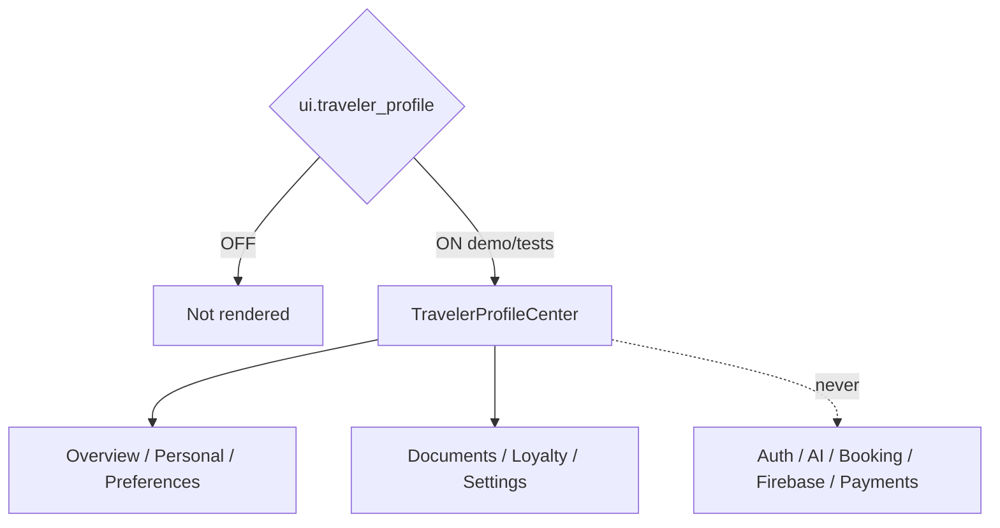

# Traveler Profile Center — Phase 5 Stage 4

**Status:** Additive presentation · Flag `ui.traveler_profile` **default OFF**  
**Depends on:** `ui.application_shell`  
**Freeze:** Production · Auth · AI · Runtime · Booking · Maps · Weather · Firebase · Notifications · payments · storage · prior PRs.

Premium Traveler Profile Center — **presentation and placeholders only**.

## Sections

Profile Overview · Personal Information · Travel Preferences · Languages · Currencies · Time Zone · Travel Documents · Multiple Passports · Visa / Boarding Pass placeholders · Emergency Contacts · Family Members · Frequent Flyer / Hotel Loyalty · Preferred Airlines / Hotels · Preferred Seat · Meal Preferences · Payment Methods placeholder · Saved Travelers · Privacy / Notification Settings · Security Center · Profile Completion

## Visuals

Profile cards · Progress ring · Document cards · Passport cards · Loyalty cards · Preference chips · Security status · Settings sections · Completion timeline

Force-render: `<TravelerProfileCenter enabled />`.
