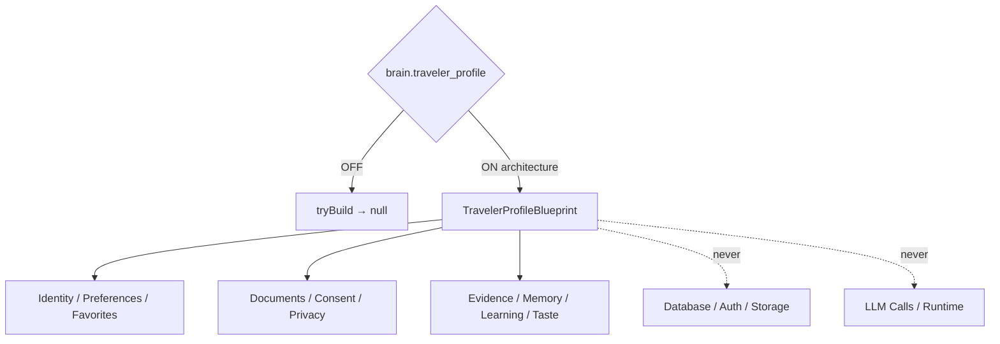

# Traveler Profile Foundation — Phase 7 Stage 1

**Status:** Architecture only · Flag `brain.traveler_profile` **default OFF**  
**Depends on:** `brain.runtime_orchestrator`  
**Distinct from:** UI flag `ui.traveler_profile` (presentation only)  
**Freeze:** Database · Auth · Storage · Passport OCR · LLM · Runtime · HTTP · Streaming · APIs · Business logic · prior PRs.

Single source of truth (architecture) for every traveler — identity, preferences, documents metadata, consent, timeline, and AI profile capability contracts.  
**Blueprints only. No implementation.**

## Package

`src/lib/orchestration/travelerProfileFoundation/`

## Created (contracts)

Traveler Profile · Identity · Preferences · Travel Style/Interests · Budget/Accommodation/Transportation/Food/Accessibility/Language · Favorites (destinations/airlines/hotels/activities) · Family · Companions · Passport/Visa metadata · Documents Registry · Emergency Contacts · Notifications · Privacy · Consent · Timeline · Audit · Versioning · Status · Validation

## AI profile capabilities

Profile Evidence Builder · Traveler Memory · Context Enrichment · Preference Learning · Travel Taste Analyzer

Force blueprint: `tryBuildTravelerProfileBlueprint({ enabled: true })`.

See also: `AI_PROFILE_ARCHITECTURE.md`, `AI_PROFILE_SCHEMA.md`, `AI_PROFILE_TIMELINE.md`, `AI_PROFILE_VALIDATION.md`, `AI_EVOLUTION_PHASE7_STAGE1.md`.
