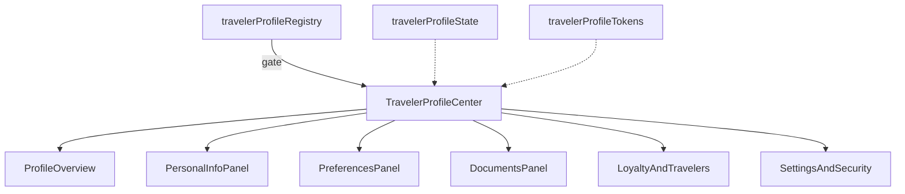

# Traveler Profile Center — Architecture Notes

**Package:** `src/ui/travelerProfile/`

| Concern | Status |
|---------|--------|
| Production routes | Not mounted |
| Authentication / storage / payments | None |
| AI / Runtime / Booking / Maps / Weather | Not wired |
| Firebase / Notifications | Not wired |
| Backend / realtime | None |
| RTL + light/dark + reduced motion | Yes |
